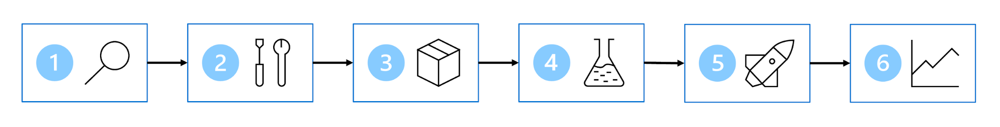
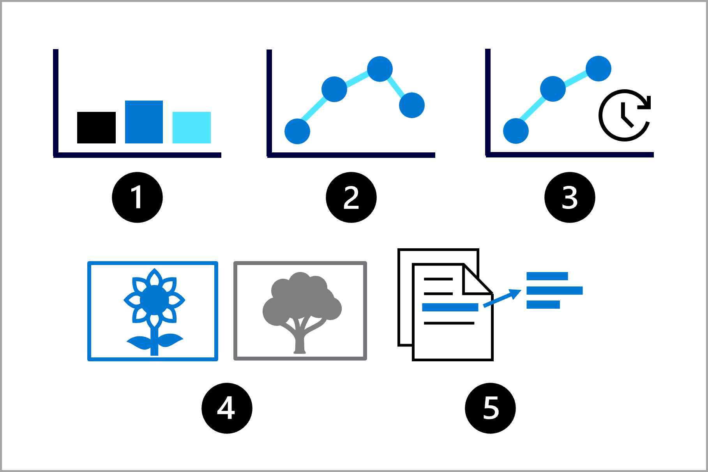
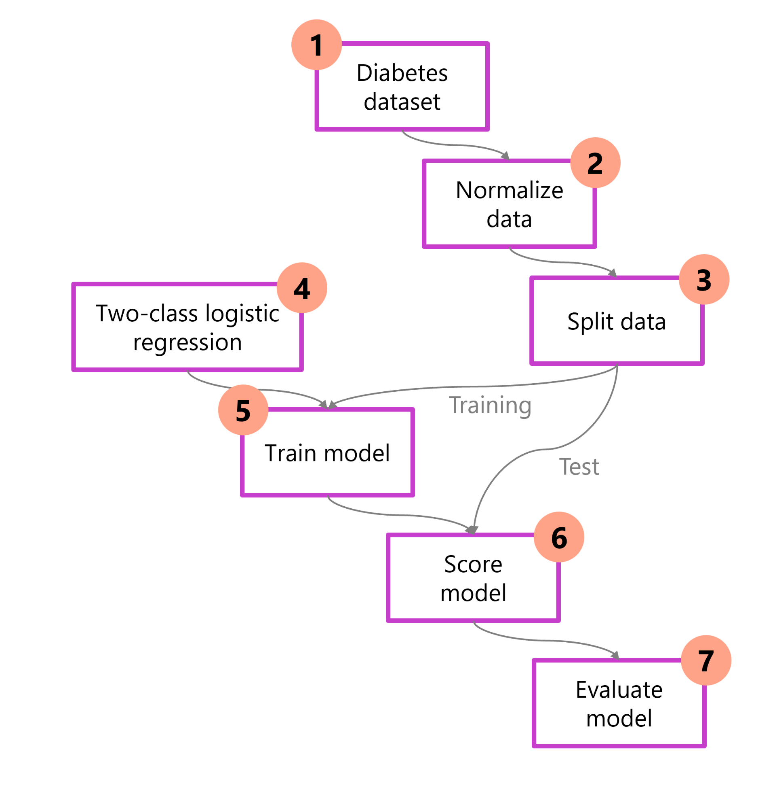
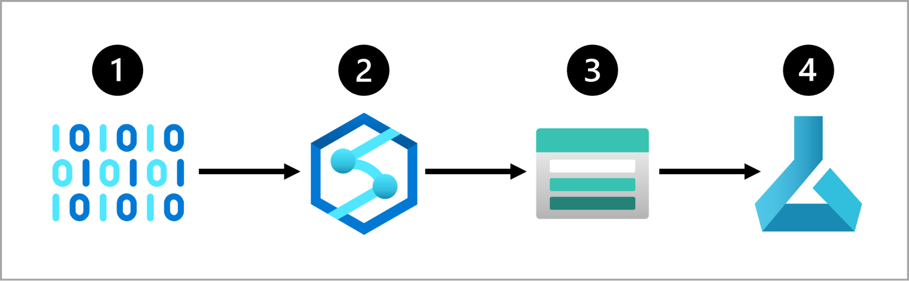
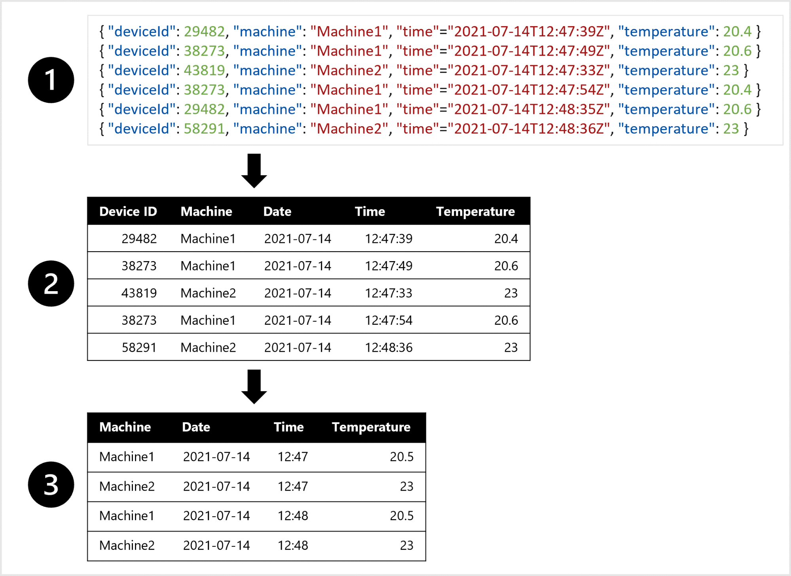
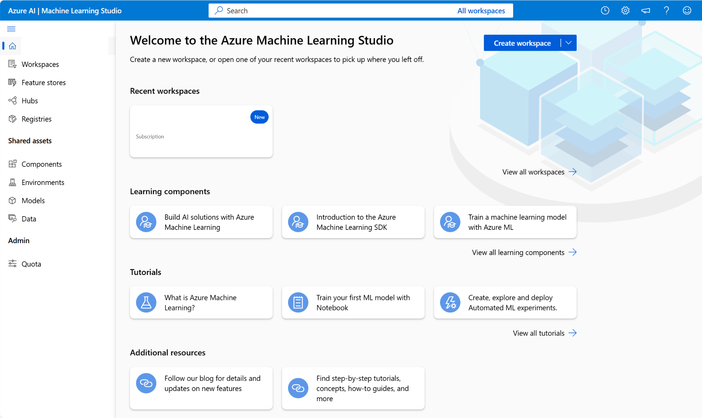
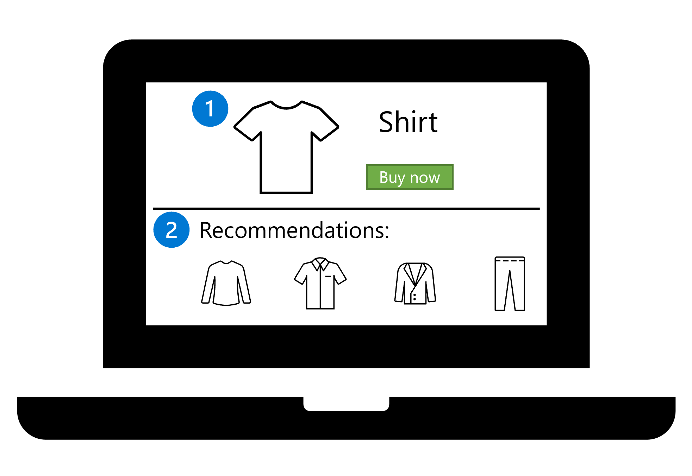
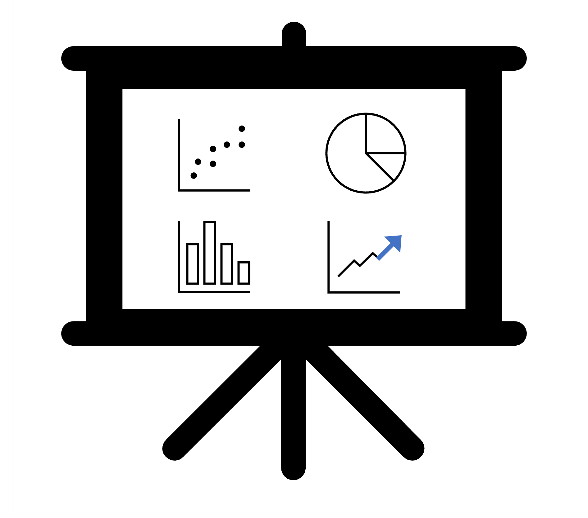
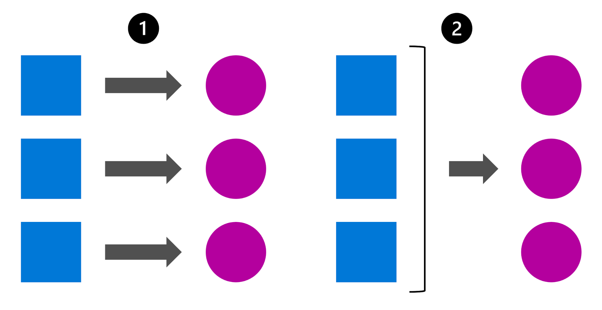

Azure에서 기계 학습 시작

신중하게 설계된 기계 학습 솔루션은 오늘날 AI 애플리케이션의 기반을 형성합니다. 예측 분석부터 개인 설정 권장 사항까지, 기계 학습 솔루션은 기존 데이터를 사용하여 새로운 인사이트를 생성함으로써 사회의 최신 기술 발전을 지원합니다.

데이터 과학자는 다양한 방법으로 기계 학습 문제를 해결하기 위한 결정을 내립니다. 결정 사항은 솔루션의 비용, 속도, 품질 및 장수에 영향을 줍니다.

이 모듈에서는 Microsoft Azure를 사용하여 엔터프라이즈 환경에서 사용할 수 있는 엔드투엔드 기계 학습 솔루션을 설계하는 방법을 알아봅니다. 다음 6단계를 프레임워크로 사용하여 기계 학습 솔루션을 계획, 학습, 배포 및 모니터링하는 방법을 살펴보겠습니다.

  1. 문제 정의: 모델이 예측해야 하는 대상과 성공 시기를 결정합니다.
  2. 데이터 가져오기: 데이터 원본을 찾고 액세스 권한을 얻습니다.
  3. 데이터 준비하기: 데이터를 탐색하기. 모델의 요구 사항에 따라 데이터를 정리하고 변환합니다.
  4. 모델 학습: 시행 착오에 따라 알고리즘 및 하이퍼 매개 변수 값을 선택합니다.
  5. 모델 통합: 예측을 생성하기 위해 모델을 엔드포인트에 배포합니다.
  6. 모델 모니터링: 모델의 성능을 추적합니다.

 참고 항목

다이어그램은 기계 학습 프로세스을 간소하게 표현한 것입니다. 대체로 프로세스는 반복적이고 연속적입니다. 예를 들어 모델을 모니터링할 때 다시 돌아가 모델을 다시 학습하도록 결정할 수 있습니다.

# 문제 정의

첫 번째 단계부터 다음을 이해하여 모델에서 해결해야 하는 문제를 정의 하려고 합니다.

  * 모델이 출력해야 하는 내용
  * 사용할 기계 학습 작업의 유형
  * 모델의 성공을 평가하는 기준

가지고 있는 데이터와 모델에서 예상되는 출력에 따라 기계 학습 작업을 식별할 수 있습니다. 이 작업은 모델을 학습하는 데 사용할 수 있는 알고리즘 유형을 결정합니다.

몇 가지 일반적인 기계 학습 작업은 다음과 같습니다.

  1. 분류: 범주 값을 예측합니다.
  2. 회귀: 숫자 값을 예측합니다.
  3. 시계열 예측: 시계열 데이터를 기반으로 미래 숫자 값을 예측합니다.
  4. 컴퓨터 비전: 이미지를 분류하거나 이미지에서 개체를 검색합니다.
  5. NLP(자연어 처리): 텍스트에서 인사이트를 추출합니다.

모델을 학습시키려는 경우, 수행하려는 작업에 따라 사용할 수 있는 알고리즘 집합이 있습니다. 모델을 평가하려는 경우, 정확도 또는 정밀도와 같은 성능 메트릭을 계산할 수 있습니다. 사용 가능한 메트릭은 모델에서 수행해야 하는 작업에 따라 달라지며 모델에서 작업의 성공 여부를 판단하는 데 도움이 됩니다.

## 예 살펴보기

환자에게 당뇨병이 있는지 확인하려는 상황을 생각해 보겠습니다. 해결하려는 문제와 사용 가능한 데이터 형식에 따라 선택할 기계 학습 작업이 결정됩니다. 이 경우, 사용할 수 있는 데이터는 환자의 다른 상태 데이터 포인트입니다. 우리는 환자가 당뇨병이 있거나 당뇨병이 없는 범주 정보로 원하는 출력을 나타낼 수 있습니다. 따라서 기계 학습 작업은 분류입니다.

시작하기 전에 전체 프로세스를 이해하면 성공적인 기계 학습 솔루션을 설계하는 데 필요한 의사 결정을 매핑할 수 있는 기회가 제공됩니다. 다음은 환자의 당뇨병을 식별하는 문제에 접근하는 한 가지 방법을 보여 주는 다이어그램입니다. 이 다이어그램에서는 특정 알고리즘을 사용하여 데이터가 준비, 분할, 학습됩니다. 그 후, 모델의 품질을 평가합니다.

  1. 데이터 로드: 데이터 세트를 가져오고 검사합니다.
  2. 전처리 데이터: 일관성을 위해 정규화하고 정리합니다.
  3. 데이터 분할: 학습 및 테스트 집합으로 구분합니다.
  4. 모델 선택: 알고리즘을 선택하고 구성합니다.
  5. 학습 모델: 학습 데이터에서 패턴을 알아봅니다.
  6. 모델 점수 매기기: 테스트 데이터에 대한 예측을 생성합니다.
  7. 평가: 성능 메트릭을 계산합니다.

기계 학습 모델을 학습하는 것은 종종 반복적인 프로세스으로, 각 단계를 여러 번 반복하여 가장 성능이 좋은 모델을 찾습니다. 다음으로, 기계 학습 솔루션을 개발하기 위한 데이터 준비 프로세스를 살펴보겠습니다.

# 데이터 수집 및 준비

데이터는 기계 학습의 기반입니다. 데이터 수량과 데이터 품질은 모두 모델의 정확도에 영향을 미칩니다.

기계 학습 모델을 학습하려면 다음을 수행해야 합니다.

  * 데이터 원본 및 형식을 식별합니다.
  * 데이터를 제공하는 방법을 선택합니다.
  * 데이터 수집 솔루션을 설계합니다.

기계 학습 모델을 학습하는 데 사용하는 데이터를 가져오고 준비 하려면 원본에서 데이터를 추출하고 모델을 학습하거나 예측하는 데 사용하려는 Azure 서비스에서 사용할 수 있도록 해야 합니다.

## 데이터 원본 및 형식 식별

먼저 데이터 원본과 현재 데이터 형식을 식별해야 합니다.

다음을 식별합니다.| 예제  
---|---  
데이터 원본| 예를 들어 데이터는 CRM(고객 관계 관리) 시스템 또는 SQL Database 같은 트랜잭션 데이터베이스에 저장되거나 IoT(사물 인터넷) 디바이스에서 생성될 수 있습니다.  
데이터 형식| 데이터의 현재 형식을 이해해야 하며, 이는 테이블 형식 또는 구조화된 데이터, 반구조화된 데이터 또는 구조화되지 않은 데이터일 수 있습니다.  
  
그런 다음 모델을 학습하는 데 필요한 데이터와 해당 데이터를 모델에 제공하려는 형식을 결정해야 합니다.

## 데이터 수집 솔루션 설계

일반적으로 분석하기 전에 원본에서 데이터를 추출하는 것이 가장 좋습니다. 데이터 엔지니어링, 데이터 분석 또는 데이터 과학에 데이터를 사용하는 경우 원본에서 데이터를 추출하고 변환한 다음 서비스 계층으로 로드해야 합니다. 이러한 프로세스를 ETL(추출, 변환 및 로드) 또는 ELT(추출, 로드 및 변환)라고도 합니다. 서비스 계층은 기계 학습 모델의 학습 같은 추가적인 데이터 처리에 사용하는 서비스를 데이터에 제공합니다.

데이터를 이동하고 변환하려면 데이터 수집 파이프라인을 사용할 수 있습니다. 데이터 수집 파이프라인은 데이터를 이동하고 변환하는 일련의 작업입니다. 파이프라인을 만들면 작업을 수동으로 트리거하거나 작업을 자동화할 때 파이프라인을 예약할 수 있습니다. 이러한 파이프라인은 Azure Synapse Analytics, Azure Databricks 및 Azure Machine Learning과 같은 Azure 서비스를 사용하여 만들 수 있습니다.

데이터 수집 솔루션에 대한 일반적인 접근 방식은 다음과 같습니다.

  1. 원본(예: CRM 시스템 또는 IoT 디바이스)에서 원시 데이터를 추출합니다.
  2. Azure Synapse Analytics를 사용하여 데이터를 복사 및 변환합니다.
  3. 준비된 데이터를 Azure Blob Storage에 저장합니다.
  4. Azure Machine Learning을 사용하여 모델을 학습시킵니다.

## 예 살펴보기

일기 예보 모델을 학습시키고 싶다고 가정해 보십시오. 1분 단위로 측정된 모든 온도 값이 결합되어 있는 하나의 테이블을 선호합니다. 데이터의 집계를 만들고 시간당 평균 온도 테이블을 사용하고자 합니다. 테이블을 만들기 위해 간격을 두고 온도를 측정하는 IoT 디바이스에서 수집된 반정형 데이터를 테이블 형식 데이터로 변환하고자 합니다.

예를 들어 예측 모델을 학습하는 데 사용할 수 있는 데이터 세트를 만들려면 다음을 실행합니다.

  1. 데이터 측정값을 IoT 디바이스에서 JSON 개체로 추출합니다.
  2. JSON 개체를 테이블로 변환합니다.
  3. 컴퓨터별 분당 온도를 가져오도록 데이터를 변환합니다.

# 모델 학습

기계 학습 모델을 학습시키는 데 사용할 수 있는 많은 서비스가 있습니다. 사용하는 서비스는 다음과 같은 요인에 따라 달라집니다.

  * 학습시켜야 하는 모델 유형,
  * 모델 학습에 대한 전체 권한이 필요한지 여부,
  * 모델 학습에 투자하려는 시간,
  * 조직 내에 이미 있는 서비스,
  * 익숙한 프로그래밍 언어

Azure 내에는 기계 학습 모델을 학습시키는 데 사용할 수 있는 여러 서비스가 있습니다. 일반적으로 사용되는 서비스 중 일부는 다음과 같습니다.

아이콘| 설명  
---|---  
| Azure Machine Learning 은 기계 학습 모델을 학습하고 관리하는 다양한 옵션을 제공합니다. UI 기반 환경을 위해 Studio로 작업하거나 코드 우선 환경을 위해 Python SDK 또는 CLI를 사용하여 기계 학습 워크로드를 관리할 수 있습니다. [Azure Machine Learning](https://www.google.com/url?q=https://learn.microsoft.com/ko-kr/azure/machine-learning/overview-what-is-azure-machine-learning&sa=D&source=editors&ust=1766978491244755&usg=AOvVaw3tqEkNoLk2J1LgXaCBDPWD)에 대해 자세히 알아봅니다.  
| Azure Databricks 는 데이터 엔지니어링 및 데이터 과학에 사용할 수 있는 데이터 분석 플랫폼입니다. Azure Databricks는 분산된 Spark 컴퓨팅을 사용하여 데이터를 효율적으로 처리합니다. Azure Databricks를 사용하거나 Azure Databricks를 Azure Machine Learning과 같은 다른 서비스와 통합하여 모델을 학습시키고 관리할 수 있습니다. [Azure Databricks](https://www.google.com/url?q=https://learn.microsoft.com/ko-kr/azure/databricks/what-is-databricks&sa=D&source=editors&ust=1766978491245436&usg=AOvVaw0ufBU7gS2P-iZ10trublWN)에 대해 자세히 알아봅니다.  
| Microsoft Fabric 은 데이터 분석가, 데이터 엔지니어 및 데이터 과학자 간의 데이터 워크플로를 간소화하도록 설계된 통합 분석 플랫폼입니다. Microsoft Fabric을 사용하면 데이터를 준비하고, 모델을 학습시키고, 학습된 모델을 사용하여 예측을 생성하고, Power BI 보고서의 데이터를 시각화할 수 있습니다. [Microsoft Fabric](https://www.google.com/url?q=https://learn.microsoft.com/ko-kr/fabric/get-started/microsoft-fabric-overview&sa=D&source=editors&ust=1766978491246095&usg=AOvVaw00o0_cdzQUe-isKffWdY36) 및 특히 Microsoft [Fabric의 데이터 과학 기능에](https://www.google.com/url?q=https://learn.microsoft.com/ko-kr/fabric/data-science/&sa=D&source=editors&ust=1766978491246227&usg=AOvVaw2O0_NDD921jmCvko395PXr) 대해 자세히 알아봅니다.  
| Foundry Tools 는 이미지의 개체 감지와 같은 일반적인 기계 학습 작업에 사용할 수 있는 미리 빌드된 기계 학습 모델의 컬렉션입니다. 모델은 API(애플리케이션 프로그래밍 인터페이스)로 제공되므로 모델을 애플리케이션과 쉽게 통합할 수 있습니다. 일부 모델은 자체 학습 데이터로 사용자 지정하여 새 모델을 처음부터 학습시키는 데 드는 시간과 리소스를 절약할 수 있습니다. [주조 도구](https://www.google.com/url?q=https://learn.microsoft.com/ko-kr/azure/cognitive-services/what-are-cognitive-services&sa=D&source=editors&ust=1766978491247246&usg=AOvVaw21jpEfhrP0hugkSME76sKi)에 대해 자세히 알아보세요.  
  
## Azure Machine Learning의 특징 및 기능

Azure Machine Learning에 집중해 보겠습니다. Microsoft Azure Machine Learning은 기계 학습 모델을 학습, 배포 및 관리하기 위한 클라우드 서비스입니다. 데이터 과학자, 소프트웨어 엔지니어, devops 전문가 및 기타 사용자가 기계 학습 프로젝트의 엔드투엔드 수명 주기를 관리하는 데 사용하도록 설계되었습니다.

Azure Machine Learning은 다음을 포함한 작업을 지원합니다.

  * 데이터를 탐색하고 모델링을 위해 준비합니다.
  * 기계 학습 모델 학습 및 평가
  * 학습된 모델 등록 및 관리
  * 애플리케이션 및 서비스에서 사용할 학습된 모델 배포
  * 책임 있는 AI 원칙 및 사례를 검토하고 적용합니다.

Azure Machine Learning은 기계 학습 워크로드를 지원하기 위해 다음과 같은 기능과 기능을 제공합니다.

  * 모델 학습 및 평가를 위한 데이터 세트의 중앙 집중식 스토리지 및 관리
  * 모델 학습과 같은 기계 학습 작업을 실행할 수 있는 주문형 컴퓨팅 리소스입니다.
  * AutoML(자동화된 기계 학습)을 사용하면 다양한 알고리즘 및 매개 변수를 사용하여 여러 학습 작업을 쉽게 실행하여 데이터에 가장 적합한 모델을 찾을 수 있습니다.
  * 모델 학습 또는 추론과 같은 프로세스에 대한 오케스트레이션된 파이프라인 을 정의하는 시각적 도구입니다.
  * MLflow와 같은 일반적인 기계 학습 프레임워크와 통합되어 대규모로 모델 학습, 평가 및 배포를 보다 쉽게 관리할 수 있습니다.
  * 모델 설명 가능성, 공정성 평가 등을 포함하여 책임 있는 AI에 대한 메트릭을 시각화하고 평가하기 위한 기본 제공 지원.

다음으로, 사용자 인터페이스에서 Azure Machine Learning을 시작하는 방법을 살펴보겠습니다.

# Azure Machine Learning 스튜디오 사용

기계 학습 리소스 및 작업을 관리하기 위한 브라우저 기반 포털인 Azure Machine Learning Studio를 사용하여 다양한 유형의 기계 학습 기능에 액세스할 수 있습니다.

Azure Machine Learning 스튜디오에서는 다음을 수행할 수 있습니다.

  * 데이터를 가져오고 탐색합니다.
  * 컴퓨팅 리소스를 만들고 사용합니다.
  * Notebook에서 코드를 실행합니다.
  * 시각적 도구를 사용하여 작업 및 파이프라인을 만듭니다.
  * 자동화된 기계 학습을 사용하여 모델을 학습시킵니다.
  * 평가 메트릭, 책임 있는 AI 정보 및 학습 매개 변수를 포함하여 학습된 모델의 세부 정보를 봅니다.
  * 요청 및 일괄 처리 추론을 위해 학습된 모델을 배포합니다.
  * 포괄적인 모델 카탈로그에서 모델을 가져오고 관리합니다.

## Azure Machine Learning 리소스 프로비전

Azure Machine Learning에 필요한 기본 리소스는 Azure 구독에서 프로비전할 수 있는 Azure Machine Learning 작업 영역입니다. 스토리지 계정, 컨테이너 레지스트리, 가상 머신 등을 비롯한 기타 지원 리소스는 필요에 따라 자동으로 만들어집니다. Azure Portal에서 Azure Machine Learning 작업 영역을 만들 수 있습니다.

#### 컴퓨팅 옵션 중에서 결정

Azure Machine Learning을 사용하여 모델을 학습하는 경우 컴퓨팅을 선택해야 합니다. 컴퓨팅은 학습 프로세스를 수행하는 데 필요한 계산 리소스를 나타냅니다. 모델을 학습할 때마다 학습에 걸리는 시간과 코드 실행에 사용되는 컴퓨팅의 양을 모니터링해야 합니다. 컴퓨팅 사용률을 모니터링하면 컴퓨팅을 스케일 업 또는 스케일 다운할지 여부를 알 수 있습니다.

로컬 디바이스에서 모델을 학습하는 대신 Azure로 작업하도록 선택하면 스케일링 가능하고 비용 효율적인 컴퓨팅에 액세스할 수 있습니다.

컴퓨팅 옵션| 고려 사항  
---|---  
CPU(중앙 처리 장치) 또는 GPU(그래픽 처리 장치)| 작은 테이블 형식 데이터 세트의 경우 CPU면 충분하고 비용 효율적입니다. 이미지 또는 텍스트와 같은 비정형 데이터의 경우 GPU가 더 강력하고 효율적입니다. 더 큰 테이블 형식 데이터 세트를 대상으로 CPU 컴퓨팅이 충분하지 않을 경우 GPU를 사용할 수도 있습니다.  
범용 또는 메모리 최적화| 범용의 경우 균형 잡힌 CPU-메모리 비율을 가지고 있으며, 이는 소규모 데이터 세트를 사용하여 테스트하고 개발하는 데 이상적입니다. 메모리 최적화의 경우 메모리-CPU 비율이 높습니다. 메모리 내 분석에 적합하고, 데이터 세트가 더 크거나 Notebook에서 작업할 때 이상적입니다.  
  
요구 사항에 가장 합당하는 컴퓨팅 옵션이 무엇인지 찾아내는 것은 종종 시행착오가 필요합니다. 코드를 실행할 때 컴퓨팅 사용률을 모니터링하여 사용 중인 컴퓨팅 리소스의 양을 이해해야 합니다. 컴퓨팅 크기가 가장 큰 경우에도 모델 학습이 너무 오래 걸리는 경우 CPU 대신 GPU를 사용할 수 있습니다. 또는 Spark 컴퓨팅을 사용하여 모델 학습을 분산시키도록 선택할 수 있고, 학습 스크립트를 다시 작성해야 합니다.

## Azure 자동화된 머신 러닝

Azure Machine Learning의 자동화된 기계 학습 기능을 사용하는 경우 컴퓨팅이 자동으로 할당됩니다. Azure 자동화된 기계 학습은 기계 학습 모델 개발의 시간이 오래 걸리고 반복적인 작업을 자동화합니다.

Azure Machine Learning 스튜디오에서 자동화된 기계 학습을 사용하여 코드를 작성하지 않고도 이 모듈에 설명된 것과 동일한 단계를 사용하여 학습 실험을 디자인하고 실행할 수 있습니다. Azure 자동화된 기계 학습은 기계 학습 학습 작업을 실행하는 데 도움이 되는 단계별 마법사를 제공합니다. 자동화된 학습은 회귀, 시계열 예측, 분류, 컴퓨터 비전 및 자연어 처리 작업을 비롯한 많은 기계 학습 작업에 사용할 수 있습니다. AutoML 내에서 사용자 고유의 데이터 세트에 액세스할 수 있습니다. 학습된 기계 학습 모델을 서비스로 배포할 수 있습니다.

# 모델 통합

모델을 학습하는 방법 또는 사용하는 학습 데이터에 영향을 주므로 모델을 통합하는 방법을 계획해야 합니다. 모델을 통합하려면 모델을 엔드포인트에 배포해야 합니다. 실시간 또는 일괄 예측을 위해 모델을 엔드포인트에 배포할 수 있습니다.

## 엔드포인트에 모델 배포

모델을 학습시킬 때 모델을 애플리케이션에 통합하는 것이 목표인 경우가 많습니다.

모델을 애플리케이션에 쉽게 통합하기 위해 엔드포인트를 사용할 수 있습니다. 간단히 말해, 엔드포인트는 애플리케이션이 메시지를 다시 가져오기 위해 호출할 수 있는 웹 주소가 될 수 있습니다.

엔드포인트에 모델을 배포하는 경우 다음 두 가지 옵션이 있습니다.

  * 실시간 예측 가져오기
  * 일괄 예측 가져오기

### 실시간 예측 가져오기

모델이 들어오는 새 데이터의 점수를 매기도록 하려면 실시간으로 예측이 필요합니다.

모바일 앱 또는 웹 사이트와 같은 애플리케이션에서 모델을 사용하는 경우 실시간 예측이 필요한 경우가 많습니다.

제품 카탈로그가 포함된 웹 사이트가 있다고 상상해 보세요.

  1. 고객이 웹 사이트에서 셔츠와 같은 제품을 선택합니다.
  2. 고객의 선택에 따라 모델은 제품 카탈로그의 다른 상품을 즉시 추천합니다. 웹 사이트에는 모델의 추천 제품이 표시됩니다.

고객은 언제든 웹 상점에서 제품을 선택할 수 있습니다. 모델이 거의 즉시 추천 제품을 찾기를 원합니다. 웹 페이지에서 셔츠 세부 정보를 로드하고 표시하는 데 걸리는 시간은 추천 또는 예측을 가져오는 데 걸리는 시간입니다. 이후 셔츠가 표시되면 추천 또한 표시될 수 있습니다.

### 일괄 예측 가져오기

모델이 새 데이터의 점수를 일괄로 매기고 결과를 파일 또는 데이터베이스에 저장하려면 일괄 예측이 필요합니다.

예를 들어 향후 주마다 오렌지 주스 판매를 예측하는 모델을 학습시킬 수 있습니다. 오렌지 주스 판매를 예측하여 공급이 예상 수요를 충족하기에 충분한지 확인할 수 있습니다.

보고서의 모든 과거 판매 데이터를 시각화하고 있다고 상상해 보세요. 판매 예측을 동일한 보고서에 포함하려고 합니다.

오렌지 주스는 하루 종일 판매되지만 일주일에 한 번만 예측을 계산하려고 합니다. 일주일 내내 판매 데이터를 수집하고 전체 주의 판매 데이터가 있는 경우에만 모델을 호출할 수 있습니다. 데이터 포인트의 컬렉션을 배치라고 합니다.

## 실시간 또는 일괄 배포 중 결정

실시간 또는 일괄 배포 솔루션을 디자인할지 여부를 결정하려면 다음 질문을 고려해야 합니다.

  * 예측을 얼마나 자주 생성해야 하나요?
  * 결과가 얼마나 빨리 필요한가요?
  * 예측을 개별적으로 또는 일괄로 생성해야 합니까?
  * 모델을 실행하는 데 필요한 컴퓨팅 성능은 어느 정도인가요?

### 필요한 채점 빈도 식별

일반적인 시나리오는 모델을 사용하여 새 데이터를 채점하는 것입니다. 실시간 또는 일괄로 예측을 얻으려면 먼저 새 데이터를 수집해야 합니다.

데이터를 생성하거나 수집하는 다양한 방법이 있습니다. 새 데이터는 서로 다른 시간 간격으로 수집할 수도 있습니다.

예를 들어 1분마다 IoT(사물 인터넷) 디바이스에서 온도 데이터를 수집할 수 있습니다. 고객이 웹 상점에서 제품을 구입할 때마다 트랜잭션 데이터를 가져올 수 있습니다. 또는 3개월마다 데이터베이스에서 재무 데이터를 추출할 수 있습니다.

일반적으로 두 가지 유형의 사용 사례가 있습니다.

  1. 새 데이터가 들어오는 즉시 채점하려면 모델이 필요합니다.
  2. 시간의 흐름에 따라 수집한 새 데이터를 채점하도록 모델을 예약하거나 트리거할 수 있습니다.

실시간 또는 일괄 예측을 원하는지 여부가 반드시 새 데이터가 수집되는 빈도에 따라 달라지는 것은 아닙니다. 대신 예측을 생성해야 하는 빈도와 속도에 따라 달라집니다.

새 데이터가 수집될 때 모델의 예측이 즉시 필요한 경우 실시간 예측이 필요합니다. 모델의 예측이 특정 시간에만 사용되는 경우 일괄 예측이 필요합니다.

### 예측 수 결정

또 다른 중요한 질문은 예측을 개별적으로 또는 일괄적으로 생성해야 하는지 여부입니다.

개별 예측과 일괄 예측의 차이점을 설명하는 간단한 방법은 표를 상상하는 것입니다. 각 행이 고객을 나타내는 고객 데이터 표가 있다고 가정합니다. 각 고객에 대해 웹 상점에서 구매한 제품 수 및 마지막 구매 날짜와 같은 몇 가지 인구 통계 데이터 및 행동 데이터가 있습니다.

이 데이터를 기반으로 고객이 웹 상점에서 다시 구매할지 여부인 고객 이탈을 예측할 수 있습니다.

모델을 학습한 후에는 예측 생성 여부를 결정할 수 있습니다.

  * 개별적으로: 모델이 단일 데이터 행을 수신하고 개별 고객이 다시 구매할지 여부를 반환합니다.
  * 일괄 처리: 모델이 한 표의 여러 데이터 행을 수신하고 각 고객이 다시 구매할지 여부를 반환합니다. 결과는 모든 예측을 포함하는 표에 정렬됩니다.

파일을 사용할 때 개별 또는 일괄 예측을 생성할 수도 있습니다. 예를 들어 컴퓨터 비전 모델을 사용하는 경우 단일 이미지를 개별적으로 채점하거나 일괄로 이미지 컬렉션을 채점해야 할 수 있습니다.

### 컴퓨팅 비용 고려

모델을 학습할 때 컴퓨팅을 사용하는 것 외에도 모델을 배포할 때 컴퓨팅이 필요합니다. 모델을 실시간 또는 일괄 엔드포인트에 배포하는지 여부에 따라 다양한 유형의 컴퓨팅을 사용합니다. 모델을 실시간 또는 일괄 엔드포인트에 배포할지 여부를 결정하려면 각 컴퓨팅 유형의 비용을 고려해야 합니다.

실시간 예측이 필요한 경우 항상 사용할 수 있고 결과를 (거의) 즉시 반환할 수 있는 컴퓨팅이 필요합니다. ACI(Azure Container Instance) 및 AKS(Azure Kubernetes Service)와 같은 컨테이너 기술은 배포된 모델에 경량 인프라를 제공하므로 이러한 시나리오에 이상적입니다.

하지만 실시간 엔드포인트에 모델을 배포하고 이러한 컨테이너 기술을 사용하는 경우 컴퓨팅은 상시 가동되어야 합니다. 모델이 배포되면 즉각적인 예측을 위해 항상 모델을 사용할 수 있어야 하므로 컴퓨팅을 일시 중지하거나 중단할 수 없어 컴퓨팅 비용을 지속적으로 지불하게 됩니다.

또는 일괄 예측이 필요한 경우 대규모 워크로드를 처리할 수 있는 컴퓨팅이 필요합니다. 여러 노드를 사용하여 병렬 배치에 있는 데이터를 채점할 수 있는 컴퓨팅 클러스터를 사용하는 것이 좋습니다.

병렬 배치로 데이터를 처리할 수 있는 컴퓨팅 클러스터로 작업할 때, 일괄 채점이 트리거될 때 작업 공간에 의해 컴퓨팅이 프로비저닝되고 처리할 새 데이터가 없을 때 0개 노드로 축소됩니다. 작업 영역이 유휴 컴퓨팅 클러스터를 축소하도록 하여 상당한 비용을 절감할 수 있습니다.

이 모듈에서는 기계 학습 솔루션에 대한 고려 사항에 대해 알아보았습니다. 기계 학습은 최신 AI 애플리케이션의 중추를 형성하여 시스템이 예측 분석 및 개인 설정된 권장 사항과 같은 작업에 대한 데이터에서 인사이트를 생성할 수 있도록 합니다. 효과적인 ML 솔루션을 설계하려면 문제 정의, 데이터 획득 및 준비, 모델 학습, 애플리케이션에 통합 및 성능 모니터링과 같은 구조적 반복 프로세스가 포함됩니다. Microsoft Azure는 사용자가 자동화된 기계 학습과 같은 코드 우선 도구와 코드 없는 도구를 모두 사용하여 데이터를 관리하고, 실험을 실행하고, 모델을 배포하고, 결과를 모니터링할 수 있는 브라우저 기반 플랫폼인 Azure Machine Learning Studio를 통해 이 수명 주기를 지원합니다.

1\. Azure Machine Learning에서 자동화된 기계 학습을 통해 수행할 수 있는 작업은 무엇인가요?

다양한 알고리즘 및 매개 변수를 사용하여 여러 학습 작업을 자동으로 실행하여 최상의 모델을 찾습니다.

2\. 기계 학습 모델을 학습할 서비스를 선택할 때 고려해야 하는 다음 요인은 무엇입니까?

모델 학습에 투자하려는 시간

3\. 엔드 투 엔드 기계 학습 워크플로를 지원하는 Azure Machine Learning의 주요 기능은 무엇인가요?

중앙 집중식 데이터 세트 관리 및 자동화된 기계 학습을 제공합니다.
