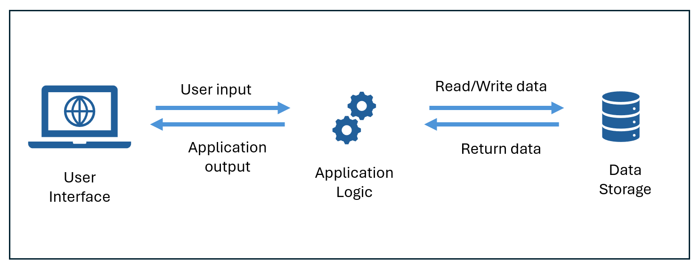
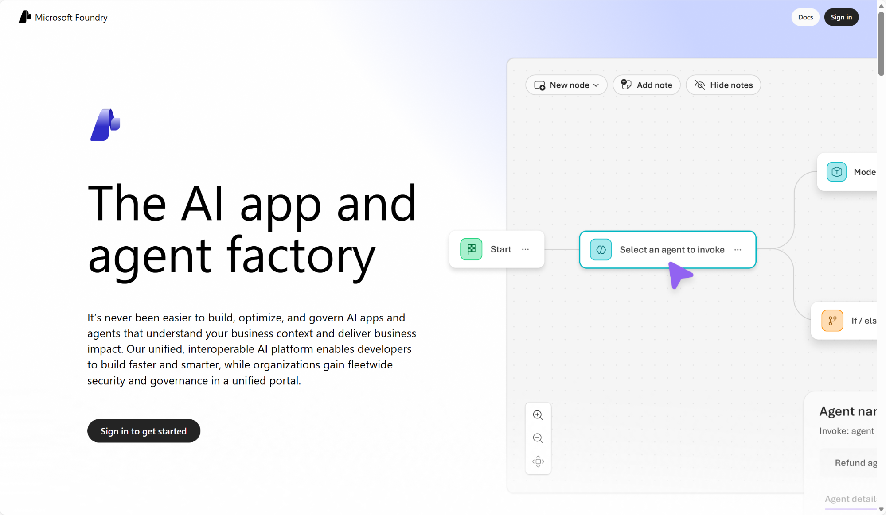
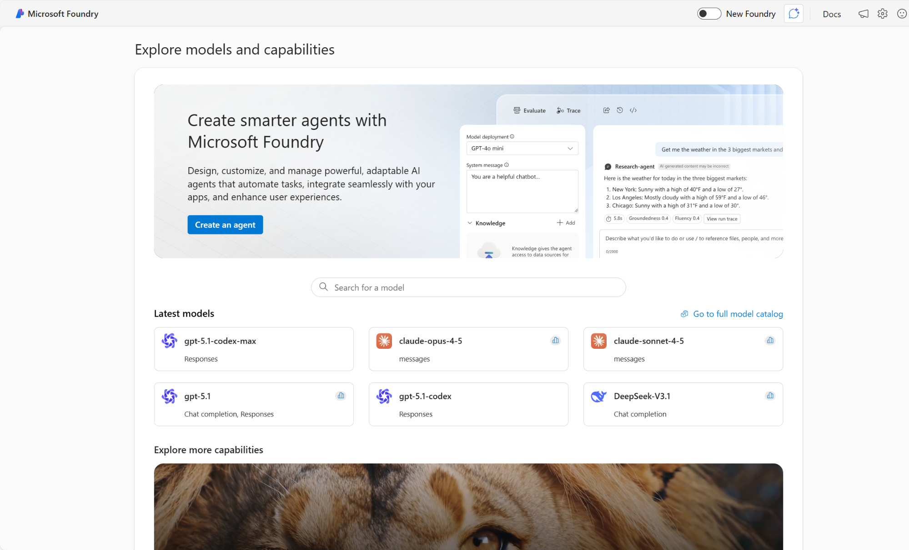
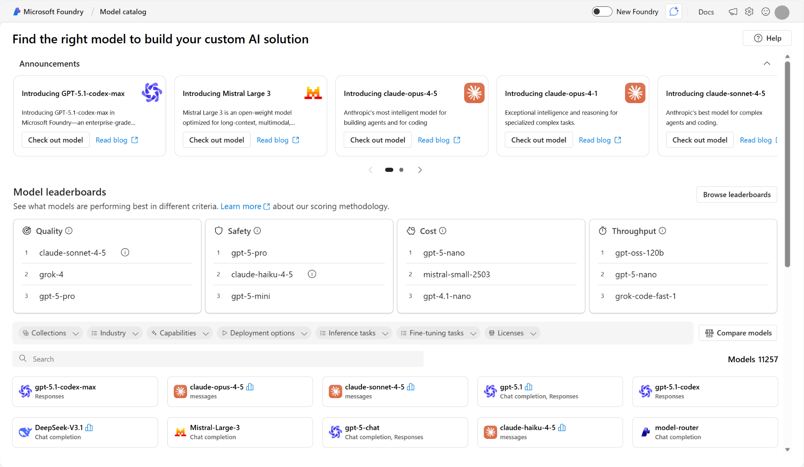
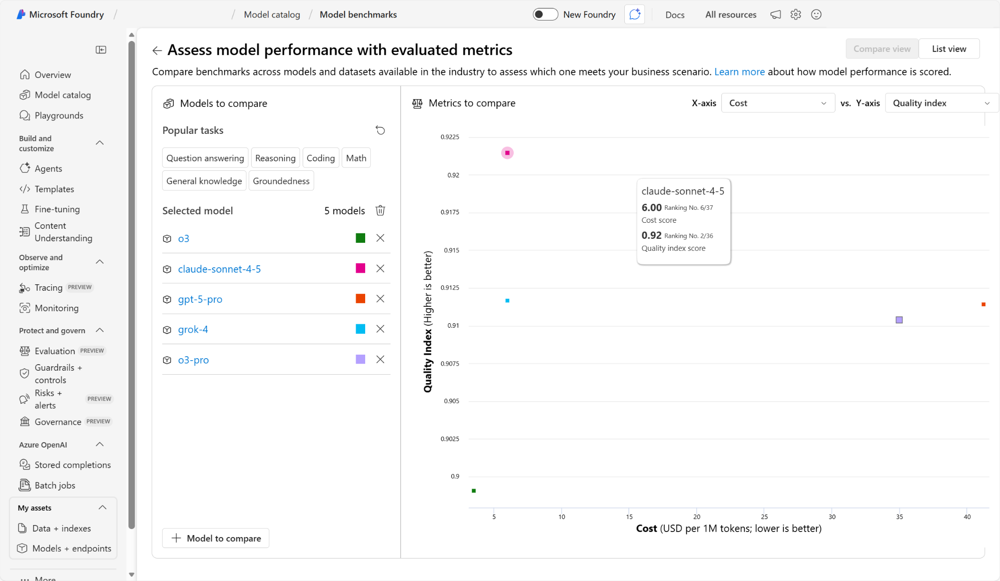
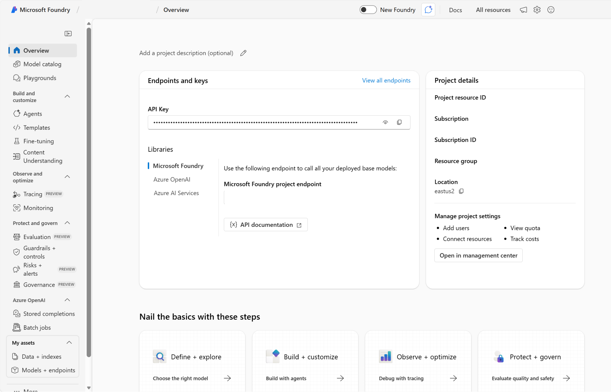
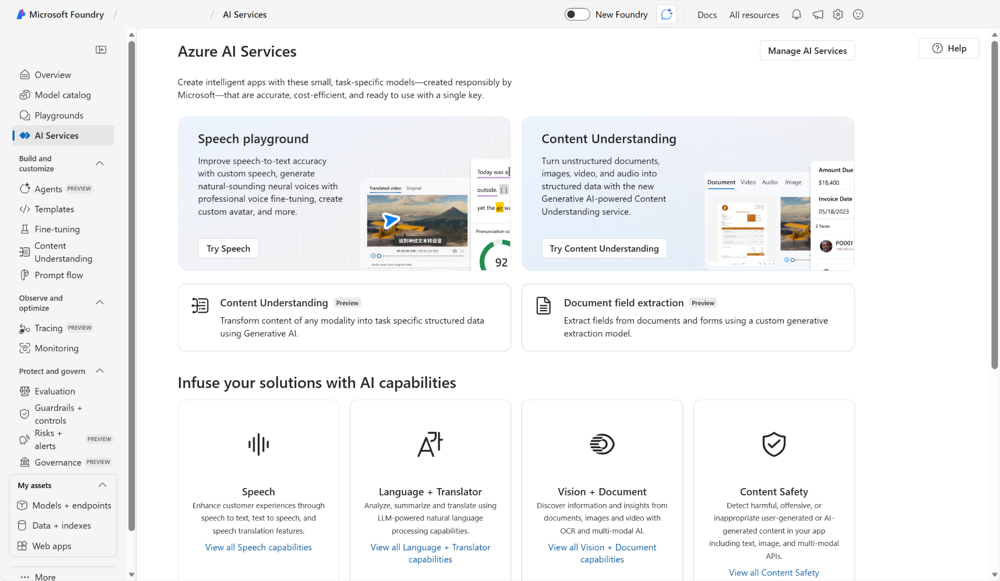
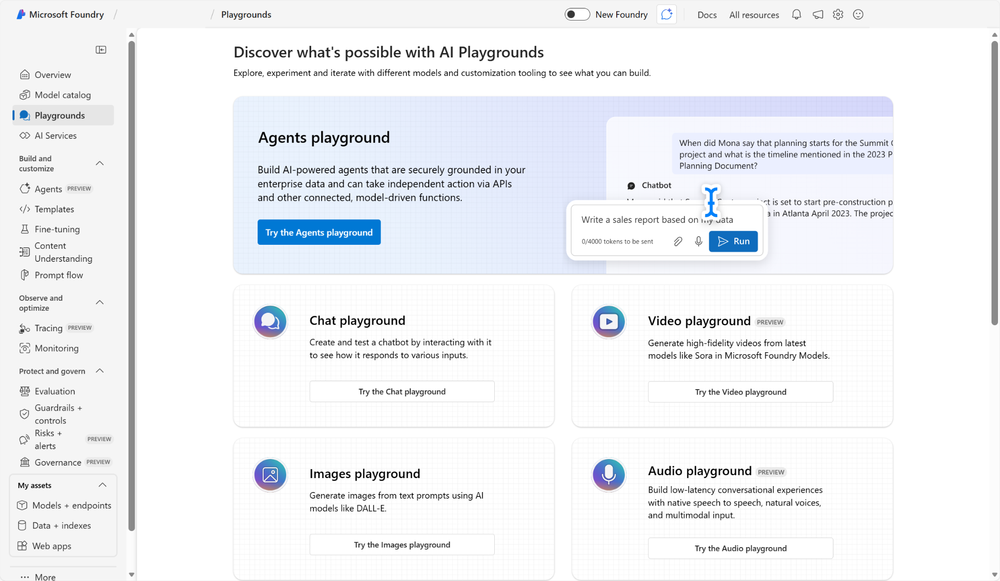
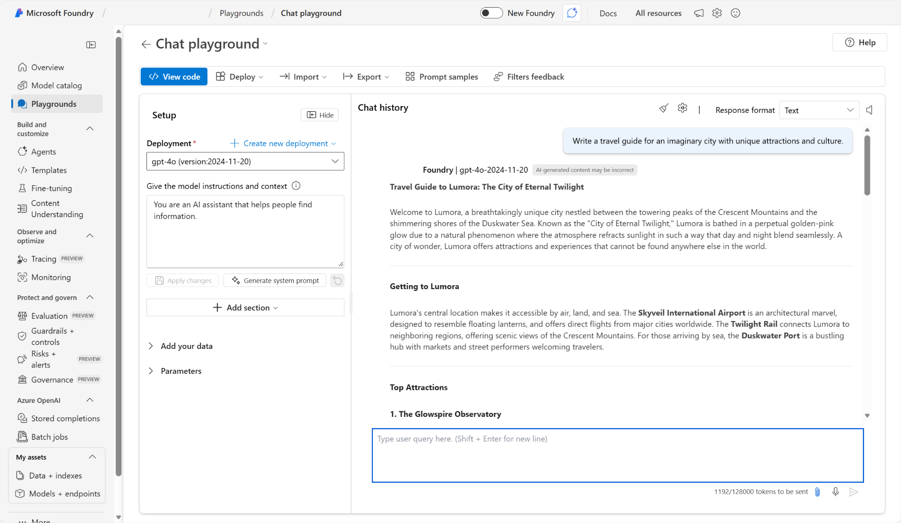

Microsoft Foundry에서 생성형 AI를 시작하기

몇 년 만에 새로운 콘텐츠를 만드는 데 중점을 둔 인공 지능의 하위 집합인 생성 AI는 작업 방식을 바꾸고 기술로 가능한 것에 혁명을 일으켰습니다. 때때로 생성 AI의 빠르게 진행되는 개발은 경험 많은 개발자조차도 추적하기가 어려울 수 있습니다.

이 모듈에서는 생성 AI 애플리케이션과 Microsoft Azure AI가 혁신을 지원하는 방법을 이해하기 위한 프레임워크를 얻습니다. 오늘날의 혁신은 어떤 모습일까요? 다음과 같은 사용 사례를 고려합니다.

  * 마케팅 콘텐츠 만들기: 회사는 Microsoft Copilot의 생성 AI를 사용하여 제품 설명, 블로그 게시물 및 소셜 미디어 콘텐츠를 자동으로 작성하여 시간을 절약하고 플랫폼 간에 브랜드 일관성을 보장합니다.
  * 고객 지원: 기업은 자연어로 고객 문의를 이해하고 응답할 수 있는 AI 기반 가상 에이전트를 배포하여 24/7 지원을 제공하고 인간 에이전트의 부하를 줄입니다.
  * 코드 생성: 개발자는 GitHub Copilot와 같은 도구를 사용하여 코드 조각을 생성하고, 함수를 제안하고, 자연어 프롬프트에 따라 전체 모듈을 작성하여 소프트웨어 개발 속도를 향상합니다.
  * 이미지 및 비디오 생성: 디자이너 및 콘텐츠 작성자는 Microsoft Foundry의 모델 카탈로그에 있는 최신 모델을 사용하여 종종 텍스트 설명에서 캠페인, 스토리보드 또는 개념 아트에 대한 시각적 개체를 생성합니다.
  * 맞춤형 학습 및 튜터링: 교육 플랫폼은 생성 AI를 사용하여 학생의 학습 스타일 및 진행 상황에 맞는 사용자 지정 퀴즈, 설명 및 학습 가이드를 만듭니다.

Microsoft는 AI 사용 및 개발을 위한 도구 에코시스템을 제공합니다. 이 모듈에서는 개발자가 생성 AI 애플리케이션을 빌드할 수 있는 도구를 자세히 살펴봅니다. 다음으로, 생성 AI 애플리케이션의 환경을 살펴봅니다.

# 생성 AI 응용 프로그램 이해하기

생성 AI 애플리케이션은 언어 모델을 사용하여 빌드됩니다. 이러한 언어 모델은 사용자와 생성 AI 간의 상호 작용의 '앱 논리' 구성 요소를 지원합니다.

## 도우미를 이해하기

생성형 AI는 종종 사용자가 정보를 찾고 효율적으로 작업을 수행하는 데 도움이 되는 애플리케이션에 통합된 채팅 기반 도우미로 나타납니다. 이러한 애플리케이션의 한 예로는 실시간 인텔리전스와 지원을 제공하여 업무 경험을 향상시키도록 설계된 AI 기반 생산성 도구인 [Microsoft Copilot](https://www.google.com/url?q=https://copilot.microsoft.com/&sa=D&source=editors&ust=1766978491305230&usg=AOvVaw2CYA07eWsnZZpTU-hBwUXX)이 있습니다.

 참고 항목

Microsoft Copilot는 광범위한 Microsoft 애플리케이션 및 사용자 환경에 통합된 생성 AI 기반 도우미입니다. 비즈니스 사용자는 Microsoft Copilot를 사용하여 AI 생성 콘텐츠 및 작업 자동화를 통해 생산성과 창의성을 높일 수 있습니다. 개발자는 Copilot를 비즈니스 프로세스 및 데이터에 통합하는 플러그 인을 만들어 Microsoft Copilot를 확장하거나, 앱 및 서비스에 생성 AI 기능을 빌드하는 부조종사 같은 에이전트를 만들 수도 있습니다. 여기에서 Microsoft Copilot에 대해 광범위하게 알아볼 수 [있습니다](https://www.google.com/url?q=https://learn.microsoft.com/ko-kr/copilot/microsoft-365/&sa=D&source=editors&ust=1766978491305776&usg=AOvVaw0EGgHEzxAhHyduiucq4p2C).

## 에이전트를 이해하다

몇 가지 예로 세금 신고 또는 배송 준비 조정과 같은 작업을 실행할 수 있는 생성 AI를 에이전트라고 합니다. 에이전트는 사용자 입력에 응답하거나 상황을 자율적으로 평가하고 적절한 조치를 취할 수 있는 애플리케이션입니다. 이러한 조치는 일련의 작업에 도움이 될 수 있습니다. 예를 들어, "임원 도우미" 에이전트는 사용자의 일정에 있는 모임 장소에 대한 세부 정보를 제공한 다음, 맵을 첨부하거나 택시나 승차 공유 서비스 예약을 자동화하여 사용자가 해당 장소로 이동하는 데 도움을 줄 수 있습니다.

에이전트에는 다음 세 가지 주요 구성 요소가 포함됩니다.

  * 추론 및 언어 이해를 지원하는 언어 모델
  * 에이전트의 목표, 동작 및 제약 조건을 정의하는 지침
  * 에이전트가 작업을 완료할 수 있도록 하는 도구 또는 함수

 참고 항목

오늘날의 AI 솔루션에는 종종 도우미, 에이전트 및 기타 AI 기능의 조합이 포함되어 있습니다. 통합 솔루션에서 효율적으로 함께 작동하도록 모델, 데이터 원본, 도구 및 워크플로와 같은 여러 AI 구성 요소를 조정하고 관리하는 프로세스를 오케스트레이션이라고 합니다.

## 생성 AI 애플리케이션을 이해하기 위한 프레임워크 사용

다양한 생성형 AI 애플리케이션을 생각하는 한 가지 방법은 이를 버킷으로 그룹화하는 것입니다. 일반적으로 산업 및 개인 생성 AI를 세 개의 버킷으로 분류할 수 있습니다. 각 버킷에는 즉시 사용할 수 있는 애플리케이션, 확장 가능한 애플리케이션 및 기초에서 빌드하는 애플리케이션 등 더 많은 사용자 지정이 필요합니다.

범주| 설명  
---|---  
즉시 사용| 이러한 애플리케이션은 즉시 사용할 수 있는 생성 AI 애플리케이션입니다. 이 도구를 활용하기 위해 사용자 쪽에서 어떠한 프로그래밍 작업도 필요하지 않습니다. 간단히 도우미에게 질문을 하는 것부터 시작해 보세요.  
확장 가능한| 일부 즉시 사용할 수 있는 애플리케이션은 사용자 고유의 데이터를 사용하여 확장할 수도 있습니다. 이러한 사용자 지정을 통해 도우미는 특정 비즈니스 프로세스나 작업을 더 잘 지원할 수 있습니다. Microsoft Copilot은 즉시 사용 가능하고 확장 가능한 기술의 예입니다.  
기초에서 빌드하는 애플리케이션| 언어 모델부터 시작하여 에이전트 기능이 있는 도우미와 자체 도우미를 직접 빌드할 수 있습니다.  
  
종종 서비스를 사용하여 생성 AI 애플리케이션을 확장하거나 빌드합니다. 이러한 서비스는 생성형 AI 모델을 개발, 학습, 배포하는 데 필요한 인프라, 도구, 프레임워크를 제공합니다. 예를 들어 Microsoft는 다른 모델에서 AI를 빌드하기 위해 Microsoft 365 Copilot 및 Microsoft Microsoft Foundry를 확장하는 Copilot Studio와 같은 서비스를 제공합니다.

다음으로, 생성 AI 애플리케이션을 확장하고 빌드하는 데 사용되는 도구를 살펴보겠습니다.

# Foundry의 생성 AI 개발 이해

Microsoft는 AI 수명 주기의 모든 단계에서 개발자, 데이터 과학자 및 기업을 지원하도록 설계된 생성 AI 솔루션을 빌드하기 위한 강력한 도구 및 서비스 에코시스템을 제공합니다. 여러 Microsoft 솔루션을 사용하여 생성 AI 솔루션을 개발할 수 있습니다. 이 모듈에서는 엔터프라이즈 AI 운영, 모델 작성기 및 애플리케이션 개발을 위한 Microsoft의 통합 플랫폼인 Microsoft Foundry에 초점을 맞춥니다.

PaaS(Platform as a Service)인 Microsoft Foundry는 개발자에게 애플리케이션 빌드에 사용되는 언어 모델의 사용자 지정을 제어할 수 있습니다. 이러한 모델은 클라우드에 배포되고 사용자 지정 개발 앱 및 서비스에서 사용할 수 있습니다.

 

AI 애플리케이션 및 에이전트를 빌드, 사용자 지정 및 관리하기 위한 사용자 인터페이스인 Microsoft Foundry를 사용할 수 있습니다( 특히 생성 AI를 통해 구동되는 사용자 인터페이스).

Microsoft Foundry의 구성 요소는 다음과 같습니다.

구성 요소| 설명  
---|---  
Microsoft Foundry 모델 카탈로그| 생성 AI 개발을 위한 다양한 모델을 검색, 비교 및 배포하기 위한 중앙 집중식 허브입니다.  
운동장| 아이디어를 빠르게 테스트하고, 모델을 사용해 보고, Foundry 모델을 탐색할 수 있는 즉시 사용할 수 있는 환경입니다.  
주조 도구| Microsoft Foundry에서는 Foundry 도구를 빌드, 테스트, 데모 참조 및 배포할 수 있습니다.  
솔루션| Microsoft Foundry에서 에이전트를 빌드하고 모델을 사용자 지정할 수 있습니다.  
관찰 가능성| 애플리케이션 모델의 사용량 및 성능을 모니터링하는 기능입니다.  
  
 참고 항목

Microsoft의 Copilot Studio 는 또 다른 생성 AI 개발 도구입니다. 기술적으로 능숙한 비즈니스 사용자 또는 개발자가 대화형 AI 환경을 만들 수 있는 로우 코드 개발 시나리오에 적합하도록 설계되었습니다. 결과 에이전트는 Microsoft 365 환경에서 호스트되고 Microsoft Teams와 같은 채팅 채널을 통해 제공되는 완전히 관리되는 SaaS(서비스로서의 소프트웨어) 솔루션입니다. Copilot Studio를 사용하면 인프라 고려 사항 및 모델 배포 세부 정보가 관리되므로 효과적인 솔루션을 만드는 데 쉽게 집중할 수 있습니다. 자세한 내용은 [https://www.microsoft.com/microsoft-copilot/microsoft-copilot-studio](https://www.google.com/url?q=https://www.microsoft.com/microsoft-copilot/microsoft-copilot-studio&sa=D&source=editors&ust=1766978491312583&usg=AOvVaw0qfKnwr_1bUg4CaXoINdKJ)를 참조하세요.

# Foundry의 모델 카탈로그 이해

Microsoft Foundry는 Microsoft에서 직접 판매하는 모델과 파트너 및 커뮤니티의 모델을 포함하는 포괄적이고 역동적인 마켓플레이스를 제공합니다.

Foundry 모델의 Azure OpenAI 는 Microsoft의 자사 모델 제품군을 구성하며 기본 모델로 간주됩니다. 파운데이션 모델은 큰 텍스트에 미리 학습되며 상대적으로 작은 데이터 세트를 사용하는 특정 작업에 대해 미세 조정할 수 있습니다.

추가 학습 없이 Microsoft Foundry 모델 카탈로그에서 엔드포인트로 모델을 배포할 수 있습니다. 모델을 작업에 특수화하거나 도메인별 지식에서 더 잘 수행하려면 기본 모델을 사용자 지정하도록 선택할 수도 있습니다.

요구 사항에 가장 적합한 모델을 선택하려면 플레이그라운드 설정에서 다양한 모델을 테스트하고 모델 순위표(미리 보기)를 활용할 수 있습니다. 모델 순위표는 품질, 비용 및 처리량과 같은 다양한 기준에서 가장 잘 수행되는 모델을 확인할 수 있는 방법을 제공합니다. 특정 메트릭을 기반으로 모델의 그래픽 비교를 볼 수도 있습니다.

다음으로 Microsoft Foundry 기능을 시작하는 방법을 좀 더 자세히 살펴보겠습니다.

# Foundry 기능 이해

Microsoft Foundry는 허브 및 프로젝트를 기반으로 하는 사용자 인터페이스를 제공합니다. 일반적으로 허브 를 만들면 Azure AI 및 Azure Machine Learning에 대한 보다 포괄적인 액세스 권한이 제공됩니다. 허브 내에서 프로젝트를 만들 수 있습니다. 프로젝트는 모델 및 에이전트 개발에 대한 보다 구체적인 액세스를 제공합니다. Microsoft Foundry의 개요 페이지에서 프로젝트를 관리할 수 있습니다.

Azure AI Hub를 만들 때 Foundry Tools 리소스를 포함하여 여러 다른 리소스가 함께 만들어집니다. Microsoft Foundry에서 Azure Speech, Azure Language, Azure Vision 및 Microsoft Foundry Content Safety를 비롯한 모든 종류의 Foundry 도구를 테스트할 수 있습니다.

데모 외에도 Microsoft Foundry는 모델 카탈로그에서 Foundry 도구 및 기타 모델을 테스트하기 위한 플레이그라운드를 제공합니다.

## 모델 사용자 지정

생성 AI 애플리케이션에서 모델을 사용자 지정하는 방법에는 여러 가지가 있습니다. 모델을 사용자 지정하는 목적은 응답의 품질 및 안전을 포함하여 성능의 측면을 개선하는 것입니다. Microsoft Foundry에서 모델을 사용자 지정할 수 있는 네 가지 주요 방법을 살펴보겠습니다.

메서드| 설명  
---|---  
접지 데이터 사용| 접지란 시스템의 출력이 사실, 상황별 또는 신뢰할 수 있는 데이터 원본과 정렬되도록 하는 프로세스를 말합니다. 접지 작업은 모델을 데이터베이스에 연결하거나, 검색 엔진을 사용하여 실시간 정보를 검색하거나, 도메인별 기술 자료를 통합하는 등 다양한 방법으로 수행할 수 있습니다. 목표는 모델의 응답을 이러한 데이터 원본에 고정하여 생성된 콘텐츠의 신뢰성과 적용 가능성을 향상시키는 것입니다.  
RAG(검색 증강 생성) 구현| RAG는 조직의 전용 데이터베이스에 연결하여 언어 모델을 보강합니다. 이 기술에는 큐레이팅된 데이터 세트에서 관련 정보를 검색하고 이를 사용하여 상황에 맞는 정확한 응답을 생성하는 작업이 포함됩니다. RAG는 최신 및 도메인 관련 정보를 제공하여 모델의 성능을 향상시킴으로써 보다 정확하고 관련 있는 답변을 생성하는 데 도움이 됩니다. RAG는 고객 지원 또는 지식 관리 시스템과 같은 동적 데이터에 대한 실시간 액세스가 중요한 애플리케이션에 유용합니다.  
미세 조정| 미리 학습된 모델을 사용하고 특정 애플리케이션에 더 적합하도록 더 작은 작업별 데이터 세트에 대해 추가로 학습하는 작업이 포함됩니다. 이 프로세스를 통해 모델은 전문화되고, 도메인별 지식이 필요한 특정 작업을 더 잘 수행할 수 있습니다. 미세 조정은 모델을 도메인별 요구 사항에 맞게 조정하고 정확도를 향상하며 관련이 없거나 부정확한 응답을 생성할 가능성을 줄이는 데 유용합니다.  
보안 및 거버넌스 제어 관리| 액세스, 인증 및 데이터 사용을 관리하려면 보안 및 거버넌스 제어가 필요합니다. 이러한 제어 기능은 올바르지 않거나 권한이 없는 정보의 게시를 방지하는 데 도움이 됩니다.  
  
다음으로 Microsoft Foundry가 생성 AI 애플리케이션 성능 평가를 위한 도구를 제공하는 방법을 이해해 보겠습니다.

# 관찰 가능성 이해

생성 AI의 응답 품질을 측정하는 방법에는 여러 가지가 있습니다. 일반적으로 생성형 AI를 평가하고 모니터링하기 위한 세 가지 차원을 생각할 수 있습니다. 여기에는 다음이 포함됩니다.

  * 성능 및 품질 평가자: 생성된 콘텐츠의 정확도, 근거 및 관련성을 평가합니다.
  * 위험 및 안전 평가자: AI 생성 콘텐츠와 관련된 잠재적 위험을 평가하여 콘텐츠 위험으로부터 보호합니다. 여기에는 유해하거나 부적절한 콘텐츠를 생성하는 AI 시스템의 경향을 평가하는 것이 포함됩니다.
  * 사용자 지정 평가자: 특정 요구 사항 및 목표를 충족하는 산업별 메트릭입니다.

Microsoft Foundry는 생성 AI 응답의 성능과 신뢰성을 향상시키는 가시성 기능을 지원합니다. 평가자는 AI 응답의 품질, 안전성 및 안정성을 측정하는 Microsoft Foundry의 특수 도구입니다.

일부 평가기는 다음과 같습니다.

  * 근거: 검색된 컨텍스트와 관련하여 응답이 얼마나 일관된지 측정합니다.
  * 관련성: 쿼리와 관련하여 응답이 얼마나 관련성이 있는지 측정합니다.
  * 유창성: 자연어 품질과 가독성을 측정합니다.
  * 일관성: 논리적 일관성 및 응답 흐름을 측정합니다.
  * 콘텐츠 안전: 다양한 안전 문제에 대한 포괄적인 평가입니다.

다음으로 Microsoft Foundry에서 생성 AI 기능을 사용해 보겠습니다.

* * *

이 모듈에서는 사용자 상호 작용의 핵심 논리 역할을 하는 언어 모델을 통해 생성 AI 애플리케이션을 구동하는 방법을 알아보았습니다. 이러한 애플리케이션은 종종 도우미 및 에이전트로 표시됩니다. 애플리케이션을 사용하는 데 필요한 사용자 지정 수준으로 그룹화할 수 있습니다. 나머지 모듈은 생성 AI 애플리케이션을 빌드하기 위한 통합 플랫폼인 Microsoft Foundry에 초점을 맞췄습니다.

사용자가 광범위한 모델 마켓플레이스로 빌드하고, 기능을 테스트하고, 모델을 배포하고, 관찰할 수 있는 Microsoft Foundry의 생성 AI를 살펴보했습니다. 또한 개발자는 Microsoft Foundry를 사용하여 Foundry 도구를 검사하고 생성 AI 애플리케이션에 통합할 수 있다는 것을 배웠습니다.

1\. 다음 중 생성 AI 에이전트의 역할을 가장 잘 설명하는 것은 무엇입니까?

입력, 이유 및 작업을 자율적으로 이해할 수 있는 애플리케이션입니다.

2\. 다음 중 Microsoft Foundry 모델 카탈로그의 용도를 가장 잘 설명하는 것은 무엇입니까?

생성 AI용 모델을 검색, 비교 및 배포하기 위한 중앙 집중식 허브입니다.

3\. 생성 AI의 컨텍스트에서 미세 조정의 목적은 무엇인가요?

특정 애플리케이션에 더 적합하도록 작업별 데이터 세트에 대해 미리 학습된 모델을 추가로 학습해야 합니다.
