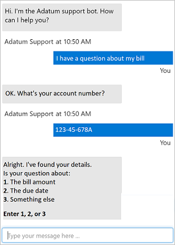
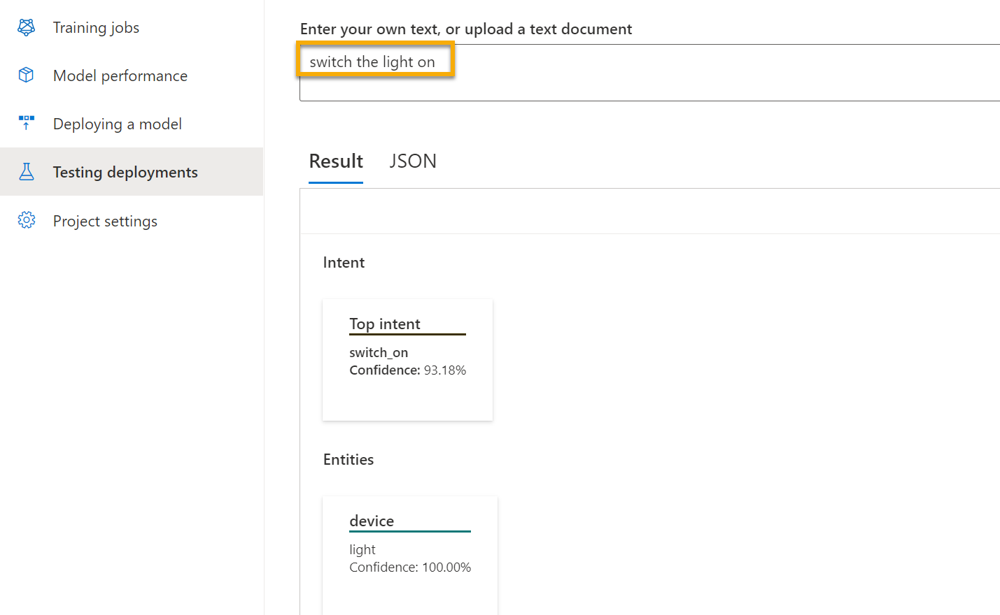
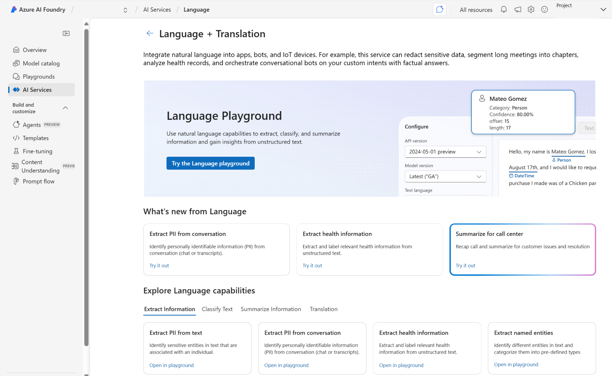
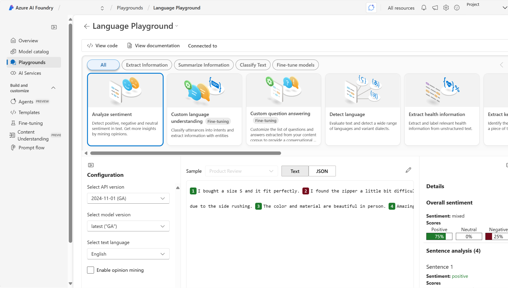
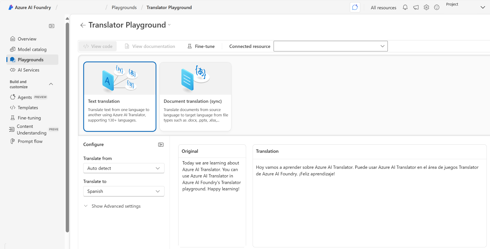

Microsoft Foundry에서 자연어 처리 시작

NLP(자연어 처리)는 기계가 인간의 언어를 이해하고 해석하고 응답할 수 있도록 하는 데 초점을 맞춘 인공 지능 분야입니다. NLP의 목표는 기존 텍스트에서 의미 또는 구조를 분석하고 추출하는 것입니다.

NLP의 이러한 애플리케이션 중 일부를 고려합니다.

  * 고객 피드백 분석: 조직은 대량의 고객 리뷰, 지원 티켓 또는 설문 조사 응답을 분석해야 합니다. 기업은 감정 분석 및 핵심 구 추출을 적용하여 추세를 식별하고, 불만을 조기에 감지하고, 고객 환경을 개선할 수 있습니다.
  * 의료 텍스트 분석: 의료 부문에서 Azure의 언어 솔루션은 구조화되지 않은 의료 문서에서 임상 정보를 추출하는 데 사용됩니다. 건강을 위한 엔터티 인식 및 텍스트 분석과 같은 기능은 증상, 약물 및 진단을 식별하여 더 빠르고 정확한 의사 결정을 지원합니다.
  * 가상 에이전트를 사용한 대화형 AI: Azure의 언어 솔루션은 사용자 의도를 해석하고, 대화를 번역하고, 관련 엔터티를 추출하고, 적절하게 응답할 수 있는 가상 도우미를 지원합니다.

다음으로, Azure에서 언어 기능을 살펴보겠습니다.

# Azure에서 자연어 처리 이해

NLP(핵심 자연어 처리) 작업에는 언어 감지, 감정 분석, 명명된 엔터티 인식, 텍스트 분류, 번역 및 요약이 포함됩니다. 이러한 작업은 다음을 포함한 Foundry 도구에서 지원됩니다.

서비스| 설명  
---|---  
 Azure 언어 서비스| 텍스트를 이해하고 분석하는 기능을 포함하는 클라우드 기반 서비스입니다. Azure Language에는 감정 분석, 핵심 구 식별, 텍스트 요약 및 대화형 언어 이해를 지원하는 다양한 기능이 포함되어 있습니다.  
 Azure Translator 서비스| 텍스트의 의미 체계 컨텍스트를 분석하고 결과적으로 보다 정확하고 완전한 번역을 렌더링하는 번역에 NMT(신경망 기계 번역)를 사용하는 클라우드 기반 서비스입니다.  
  
다음으로, Azure 언어 기능을 살펴보겠습니다.

# Azure Language의 텍스트 분석 기능 이해

Azure Language 는 구조화되지 않은 텍스트에 대해 고급 자연어 처리를 수행할 수 있는 Foundry Tools 제품의 일부입니다. Azure Language의 텍스트 분석 기능은 다음과 같습니다.

  * 명명된 엔터티 인식 은 사람, 장소, 이벤트 등을 식별합니다. 사용자 지정 범주를 추출하도록 이 기능을 사용자 지정할 수도 있습니다.
  * 엔터티 링크 는 Wikipedia에 대한 링크와 함께 알려진 엔터티를 식별합니다.
  * PII(개인 식별 정보) 검색 은 개인 건강 정보(PHI)를 포함하여 개인적으로 중요한 정보를 식별합니다.
  * 언어 감지 는 텍스트의 언어를 식별하고 영어의 경우 "en"과 같은 언어 코드를 반환합니다.
  * 감정 분석 및 오피니언 마이닝 은 텍스트가 긍정인지 부정적인지 여부를 식별합니다.
  * 요약 은 가장 중요한 정보를 식별하여 텍스트를 요약합니다.
  * 핵심 구 추출 은 구조화되지 않은 텍스트의 주요 개념을 나열합니다.

이러한 기능 중 일부를 좀 더 자세히 살펴보겠습니다.

## 엔터티 인식 및 연결

구조화되지 않은 텍스트를 Azure Language에 제공할 수 있으며 인식되는 텍스트의 엔터티 목록을 반환합니다. 엔터티는 특정 형식 또는 범주의 항목입니다. 및 경우에 따라 하위 유형이 있습니다. 예를 들면 다음과 같습니다.

유형| 서브타입| 예시  
---|---|---  
사람| | "Bill Gates", "John"  
위치| | "Paris", "New York"  
조직| | “Microsoft”  
수량| 숫자| “6” 또는 “여섯”  
수량| 백분율| "25%" 또는 "50%"  
수량| 서수| “1st” 또는 “첫 번째”  
수량| 나이| "90일" 또는 "30세"  
수량| 통화| "10.99"  
수량| 차원| "10마일", "40cm"  
수량| 온도| "45도"  
날짜와 시간| | "2012년 2월 4일 오후 6:30"  
날짜와 시간| 날짜| "2017년 5월 2일" 또는 "2017/05/02"  
날짜와 시간| 시간| "오전 8시" 또는 "8:00"  
날짜와 시간| 날짜 범위| "5월 2일부터 5월 5일까지"  
날짜와 시간| 시간 범위| "오후 6시부터 오후 7시까지"  
날짜와 시간| 기간| "1분 45초"  
날짜와 시간| 설정| "매주 화요일"  
URL| | https://www.bing.com  
전자 메일| | support@microsoft.com  
미국 기반 전화 번호| | "(312) 555-0176"  
IP 주소| | "10.0.1.125"  
  
Azure Language는 또한 엔터티 연결을 지원하여, 특정 참조에 연결함으로써 엔터티를 명확하게 구분하는 데 도움을 줍니다. 인식된 엔터티의 경우 서비스는 관련 Wikipedia 문서의 URL을 반환합니다.

예를 들어 Azure Language를 사용하여 다음 식당 리뷰 발췌문에서 엔터티를 탐지한다고 가정합니다.

지난 주에 시애틀에 있는 레스토랑에서 먹었어요.

개체| 유형| 서브타입| Wikipedia URL  
---|---|---|---  
시애틀| 위치| | https://en.wikipedia.org/wiki/Seattle  
지난주| 날짜와 시간| 날짜 범위|   
  
## 언어 감지

Azure Language의 언어 검색 기능을 사용하여 텍스트를 쓰는 언어를 식별할 수 있습니다. 제출된 각 문서에 대해 서비스는 다음을 검색합니다.

  * 언어 이름(예: "영어")입니다.
  * ISO 6391 언어 코드(예: "en")입니다.
  * 언어 감지에 대한 신뢰도 수준을 나타내는 점수입니다.

예를 들어 레스토랑을 소유하고 운영하는 시나리오를 고려해 보세요. 고객은 설문 조사를 완료하고 음식, 서비스, 직원 등에 대한 피드백을 제공할 수 있습니다. 고객으로부터 다음 리뷰를 받았다고 가정해 보겠습니다.

검토 1: "A fantastic place for lunch. The soup was delicious."

검토 2: "Comida maravillosa y gran servicio."

검토 3: "The croque monsieur avec frites was terrific. Bon appetit!"

Azure Language의 텍스트 분석 기능을 사용하여 각 리뷰에 대한 언어를 검색할 수 있습니다. 다음 결과로 응답할 수 있습니다.

문서| 언어 이름| ISO 6391 코드| 점수  
---|---|---|---  
검토 1| 영어| en| 1.0  
검토 2| 스페인어| 에스| 1.0  
검토 3| 영어| en| 0.9  
  
영어와 프랑스어가 혼합된 텍스트에도 불구하고 검토 3에서 검색된 언어는 영어입니다. 언어 감지 서비스는 텍스트의 주요 언어에 중점을 둡니다. 이 서비스는 알고리즘을 사용하여 텍스트의 다른 언어와 비교하여 구의 길이 또는 언어의 총 텍스트 양과 같은 주요 언어를 결정합니다. 주된 언어는 언어 코드와 함께 반환되는 값입니다. 혼합 언어 텍스트의 결과로 신뢰도 점수가 1보다 작을 수 있습니다.

본질적으로 모호하거나 언어 콘텐츠가 혼합된 텍스트가 있을 수 있습니다. 이러한 상황은 도전을 제시 할 수 있습니다. 모호한 콘텐츠 예제는 문서에 제한된 텍스트 또는 문장 부호만 포함된 경우입니다. 예를 들어 Azure Language를 사용하여 ":-)" 텍스트를 분석하면 언어 이름 및 언어 식별자에 대해 알 수 없는 값과 NaN 점수( 숫자가 아님을 나타내는 데 사용됨)가 생성됩니다.

## 감정 분석 및 오피니언 마이닝

Azure Language의 텍스트 분석 기능은 텍스트를 평가하고 각 문장에 대한 감정 점수와 레이블을 반환할 수 있습니다. 이 기능은 소셜 미디어, 고객 리뷰, 토론 포럼 등에서 긍정적이고 부정적인 감정을 감지하는 데 유용합니다.

Azure Language는 미리 빌드된 기계 학습 분류 모델을 사용하여 텍스트를 평가합니다. 서비스는 긍정, 중립 및 부정의 세 가지 범주로 감정 점수를 반환합니다. 각 범주에서 0에서 1 사이의 점수가 제공됩니다. 점수는 제공된 텍스트가 특정 감정일 가능성이 얼마나 되는지 나타냅니다. 하나의 문서 감정도 제공됩니다.

예를 들어 다음 두 개의 레스토랑 리뷰를 감정에 대해 분석할 수 있습니다.

검토 1: "우리는 어젯밤 그 식당에서 저녁을 먹었고 내가 처음으로 알아차린 것은 직원이 얼마나 정중했는지였습니다. 우리는 친절하게 맞이받아 바로 테이블로 안내되었습니다. 테이블은 깨끗했고, 의자는 편안했고, 음식은 놀라웠습니다."

그리고

리뷰 2: "이 레스토랑에서 우리의 식사 경험은 내가 가진 최악의 중 하나였다. 서비스는 느렸고 음식은 끔찍했습니다. 나는 이 식당에서 다시는 먹지 않을 것이다."

첫 번째 검토의 감정 점수는 문서 감정: 긍정 점수: 0.90 중립 점수: 0.10 부정 점수: 0.00일 수 있습니다.

두 번째 검토는 응답을 반환할 수 있습니다. 문서 감정: 부정 긍정 점수: 0.00 중립 점수: 0.00 부정 점수: 0.99

## 핵심 문구 추출

핵심 구 추출은 텍스트의 주요 지점을 식별합니다. 앞에서 설명한 식당 시나리오를 고려해 보세요. 설문 조사가 많은 경우 리뷰를 읽는 데 시간이 오래 걸릴 수 있습니다. 대신 언어 서비스의 핵심 구 추출 기능을 사용하여 주요 사항을 요약할 수 있습니다.

다음과 같은 리뷰를 받을 수 있습니다.

"우리는 생일 축하를 위해 여기에서 저녁 식사를했고 환상적인 경험을했습니다. 우리는 친절한 안주인에게 인사를 받았고 바로 테이블로 가져갔습니다. 앰비언스는 편안했고, 음식은 놀랍고, 서비스는 훌륭했습니다. 훌륭한 음식과 세심한 서비스를 좋아한다면 이 곳을 시도해 보아야 합니다."라고 말했습니다.

핵심 구 추출은 다음 구를 추출하여 이 검토에 대한 몇 가지 컨텍스트를 제공할 수 있습니다.

  * 생일 축하
  * 환상적인 경험
  * 친절한 안주인
  * 훌륭한 음식
  * 세심한 서비스
  * 저녁 식사
  * 테이블
  * 분위기
  * place

다음으로, Azure Language의 대화형 AI 기능을 살펴보겠습니다.

# Azure Language의 대화형 AI 기능

Azure Language에는 대화형 AI를 포함하는 다른 기능도 포함되어 있습니다. 대화형 AI는 AI와 사람 간의 대화를 가능하게 하는 솔루션을 설명합니다.

## 질문 답변

Azure Language의 질문 답변 기능은 대화형 AI 솔루션을 만드는 기능을 제공합니다. 질문 답변은 자동화된 대화 요소가 필요한 자연어 AI 워크로드를 지원합니다. 일반적으로 질문 답변은 고객 쿼리에 응답하는 봇 애플리케이션을 빌드하는 데 사용됩니다. 질문 답변 기능은 즉시 응답하고, 문제를 정확하게 답변하고, 자연스러운 다중 전환 방식으로 사용자와 상호 작용할 수 있습니다. 봇은 웹 사이트 또는 소셜 미디어 플랫폼과 같은 다양한 플랫폼에서 구현할 수 있습니다.

Azure 언어 서비스를 사용하여 Microsoft Azure에서 질문 답변 솔루션을 쉽게 만들 수 있습니다. Azure Language에는 자연어 입력을 사용하여 쿼리할 수 있는 질문 및 답변 쌍의 기술 자료를 만들 수 있는 사용자 지정 질문 답변 기능이 포함되어 있습니다.

## 대화형 언어 이해

Azure 언어 서비스는 CLU(대화형 언어 이해)를 지원합니다. CLU를 사용하여 대화형 설정에서 구의 의미를 해석하는 언어 모델을 빌드할 수 있습니다. 대화형 언어 이해는 엔드투엔드 대화형 애플리케이션을 빌드하는 데 사용할 수 있는 기능 집합을 설명합니다. 특히 이 기능을 사용하면 자연어 이해 모델을 사용자 지정하여 들어오는 구의 전반적인 의도를 예측하고 중요한 정보를 추출할 수 있습니다.

CLU 애플리케이션의 한 가지 예는 음성에 따라 디바이스를 켜고 끌 수 있는 애플리케이션입니다. 애플리케이션은 "조명 끄기"와 같은 오디오 입력을 사용하고 조명을 끄는 것과 같이 수행해야 하는 작업을 이해할 수 있습니다. 명령 및 제어, 엔드투엔드 대화 및 엔터프라이즈 지원과 관련된 많은 유형의 작업을 Azure Language의 CLU 기능으로 완료할 수 있습니다.

 참고 항목

최신 AI 솔루션에서는 여러 AI 기능이 서로 함께 작동하거나, 진화하거나, 서로 구축되는 경우가 많습니다. 이러한 대화형 AI 기능은 생성 AI 기능과 유사할 수 있습니다. 생성 AI는 NLP를 기초로 사용하지만 새 콘텐츠를 만들어 그 이상으로 확장합니다.

# Azure Translator 기능

기계 번역의 초기 시도는 리터럴 번역을 적용했습니다. 직역은 각 단어가 대상 언어의 해당 단어로 번역되는 것입니다. 이 방법에는 몇 가지 문제가 있습니다. 한 가지 예로, 대상 언어에 동등한 단어가 없을 수 있습니다. 또 다른 예시는 직역이 문장의 의미를 변경하거나 내용을 부정확하게 전달하는 경우입니다.

인공 지능 시스템은 단어뿐만 아니라 사용되는 의미 체계 컨텍스트도 이해할 수 있어야 합니다. 그러면 서비스 제공 시 입력 구문 또는 문장을 보다 정확하게 번역할 수 있습니다. 문법 규칙(공식/비공식) 및 구어체 모두가 고려 대상입니다.

Azure Translator 는 130개 이상의 언어 간에 텍스트 텍스트 변환을 지원합니다. Azure Translator를 사용할 때 하나의 언어를 원본 언어로 지정하고 여러 타겟 언어로 지정하여 원본 문서를 동시에 여러 언어로 번역할 수 있습니다.

## Azure Translator 사용

Azure Translator에는 다음과 같은 기능이 포함됩니다.

  * 텍스트 번역 \- 지원되는 모든 언어에서 실시간으로 빠르고 정확한 텍스트 번역에 사용됩니다.
  * 문서 번역 \- 원본 문서 구조를 유지하면서 지원되는 모든 언어에서 여러 문서를 번역하는 데 사용됩니다.
  * 사용자 지정 번역 \- 엔터프라이즈, 앱 개발자 및 언어 서비스 공급자가 사용자 지정된 NMT(신경망 기계 번역) 시스템을 빌드할 수 있도록 하는 데 사용됩니다.

엔터프라이즈 AI 작업, 모델 작성기 및 애플리케이션 개발을 위한 통합 플랫폼인 Microsoft Foundry에서 Azure Translator를 사용할 수 있습니다. 이 서비스는 원활한 실시간 음성 음성 변환을 가능하게 하는 엔터프라이즈용으로 특별히 설계된 모바일 애플리케이션인 Microsoft Translator Pro 에서도 사용할 수 있습니다.

다음으로 Microsoft Foundry 포털에서 언어 기능을 시작하는 방법을 알아보겠습니다.

# Microsoft Foundry 시작

Azure Language 및 Azure Translator는 애플리케이션에 언어 기능을 통합하기 위한 구성 요소를 제공합니다. 여러 Foundry 도구 중 하나로 다음을 비롯한 여러 가지 방법으로 솔루션을 만들 수 있습니다.

  * Microsoft Foundry 포털
  * SDK(소프트웨어 개발 키트) 또는 REST API

애플리케이션에서 Azure Language 또는 Azure Translator를 사용하려면 Azure 구독에 적절한 리소스를 프로비전해야 합니다. 단일 서비스 리소스 또는 Foundry 도구 리소스를 선택할 수 있습니다.

  * 언어 리소스 \- Azure 언어 서비스만 사용하려는지 또는 리소스에 대한 액세스 및 청구를 다른 서비스와 별도로 관리하려는지 선택합니다.
  * Translator 리소스 \- 각 서비스에 대한 액세스 및 청구를 개별적으로 관리할지 선택합니다.
  * Foundry 도구 리소스 \- 다른 Foundry 도구와 함께 Azure Language를 사용할 계획이며 이러한 서비스에 대한 액세스 및 청구를 함께 관리할 것인지 선택합니다.

 참고 항목

Azure를 사용하여 리소스를 만드는 방법에는 여러 가지가 있습니다. 사용자 인터페이스를 사용하여 리소스를 만들거나 스크립트를 작성할 수 있습니다. Azure Portal과 Microsoft Foundry 포털은 모두 리소스를 만들기 위한 사용자 인터페이스를 제공합니다. 실행 중인 Foundry 도구의 예제를 보려면 Microsoft Foundry 포털을 선택합니다.

## Microsoft Foundry 포털에서 시작

Microsoft Foundry는 엔터프라이즈 AI 운영, 모델 작성기 및 애플리케이션 개발을 위한 통합 플랫폼을 제공합니다. Microsoft Foundry 포털은 허브 및 프로젝트를 기반으로 하는 사용자 인터페이스를 제공합니다. Azure Language 또는 Azure Translator를 비롯한 Foundry 도구를 사용하려면 Microsoft Foundry에서 프로젝트를 만들면 Foundry Tools 리소스도 만들어 줍니다.

Microsoft Foundry의 프로젝트는 작업 및 리소스를 효과적으로 구성하는 데 도움이 됩니다. 프로젝트는 데이터 세트, 모델 및 기타 리소스에 대한 컨테이너 역할을 하므로 AI 솔루션을 보다 쉽게 관리하고 공동 작업할 수 있습니다.

Microsoft Foundry 포털 내에서 플레이그라운드 설정에서 서비스 기능을 사용해 볼 수 있습니다. Microsoft Foundry 포털은 언어 놀이터와 번역기 놀이터를 제공합니다.

1\. Azure Language를 사용하여 텍스트 문서의 주요 대화 지점을 확인하려고 합니다. 어떤 기능을 사용해야 하나요?

핵심 문구 추출

2\. Azure Language를 사용하여 문장에 대한 감정 분석을 수행합니다. 신뢰도 점수는 .04 긍정, .36 중립 및 .60 부정 점수가 반환됩니다. 이러한 신뢰도 점수는 문장 감정에 대해 무엇을 나타내나요?

문서는 부정적입니다.

3\. 텍스트 분석에서 명명된 엔터티 인식의 주요 용도는 무엇인가요?

사람, 장소 및 조직을 식별하고 분류합니다.
