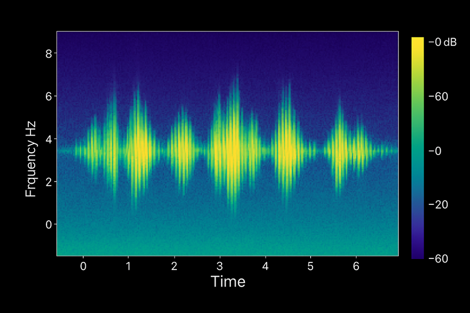
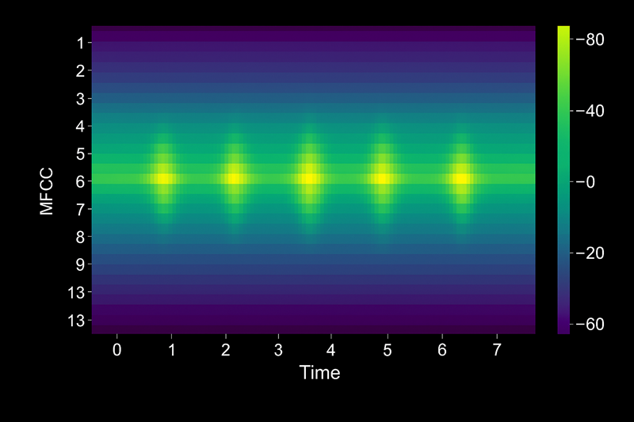

AI 음성 개념 소개

음성은 인간이 통신하는 가장 자연스러운 방법 중 하나이며, AI 애플리케이션에 음성 기능을 도입하면 보다 직관적이고 접근성이 높으며 매력적인 사용자 환경을 만들 수 있습니다. 음성 도우미를 빌드하거나, 액세스 가능한 애플리케이션을 만들거나, 대화형 AI 에이전트를 개발하는 경우 음성 기술을 이해하는 것은 최신 AI 솔루션에 필수적입니다.

이 모듈에서는 음성 인식 (음성을 텍스트로 변환) 및 음성 합성 (텍스트를 자연스러운 음성으로 변환)이라는 음성 지원 애플리케이션을 지원하는 두 가지 기본 음성 기능을 살펴봅니다. 이러한 기술이 함께 작동하여 원활한 음성 상호 작용을 만들고 음성이 사용자 환경을 변환할 수 있는 실제 시나리오에 대해 알아봅니다.

 참고 항목

우리는 다른 사람들이 다른 방법으로 배우는 것을 좋아한다는 것을 알고 있습니다. 이 모듈을 비디오 기반 형식으로 완료하도록 선택하거나 콘텐츠를 텍스트 및 이미지로 읽을 수 있습니다. 텍스트는 비디오보다 더 자세한 내용을 포함하므로 경우에 따라 비디오 프레젠테이션에 대한 추가 자료로 참조할 수 있습니다.

# 음성 사용 솔루션

완료됨

음성 기능은 사용자가 AI 애플리케이션 및 에이전트와 상호 작용하는 방식을 변환합니다. 음성 인식은 음성 단어를 텍스트로 변환하고 음성 합성은 텍스트에서 자연스러운 오디오를 생성합니다. 이러한 기술을 함께 사용하면 핸즈프리 작업을 가능하게 하고 접근성을 개선하며 보다 자연스러운 대화형 환경을 만들 수 있습니다.

음성을 AI 솔루션에 통합하면 다음을 수행할 수 있습니다.

  * 접근성 확장: 시각 장애 또는 이동성 문제가 있는 사용자에게 서비스를 제공합니다.
  * 생산성 향상: 키보드 및 화면의 필요성을 제거하여 멀티태스킹을 사용하도록 설정합니다.
  * 사용자 환경 향상: 더 인간적이고 매력적으로 느껴지는 자연스러운 대화를 만듭니다.
  * 전 세계 대상 그룹에게 도달: 여러 언어 및 지역 언어를 지원합니다.

## 일반적인 음성 인식 시나리오

음성 텍스트 변환이라고도 하는 음성 인식은 오디오 입력을 듣고 기록된 텍스트로 기록합니다. 이 기능은 광범위한 비즈니스 및 소비자 애플리케이션을 지원합니다.

### 고객 서비스 및 지원

서비스 센터는 음성 인식을 사용하여 다음을 수행합니다.

  * 에이전트 참조 및 품질 보증을 위해 실시간으로 고객 호출을 기록합니다.
  * 발신자가 말하는 내용에 따라 올바른 부서로 발신자를 라우팅합니다.
  * 통화 감정을 분석하고 일반적인 고객 문제를 식별합니다.
  * 규정 준수 및 학습을 위해 검색 가능한 호출 레코드를 생성합니다.

비즈니스 가치: 수동 메모 작성을 줄이고 응답 정확도를 개선하며 서비스 품질을 향상시키는 인사이트를 캡처합니다.

### 음성 활성화 도우미 및 에이전트

가상 도우미 및 AI 에이전트는 음성 인식에 의존하여 다음을 수행합니다.

  * 디바이스 및 애플리케이션을 핸즈프리로 제어할 수 있는 음성 명령을 수락합니다.
  * 자연어 이해를 사용하여 질문에 답변합니다.
  * 미리 알림 설정, 메시지 보내기 또는 정보 검색과 같은 작업을 완료합니다.
  * 스마트 홈 디바이스, 자동차 시스템 및 웨어러블 기술을 제어합니다.

비즈니스 가치: 화면이 실용적이지 않은 경우 사용자 참여를 늘리고 복잡한 워크플로를 간소화하며 작업을 가능하게 합니다.

### 회의 및 면접 전사

조직은 다음과 같이 대화를 기록합니다.

  * 검색 가능한 모임 메모 및 작업 항목 목록을 만듭니다.
  * 청각 장애가 있는 참가자를 위한 실시간 캡션을 제공합니다.
  * 인터뷰, 포커스 그룹 및 연구 세션의 요약을 생성합니다.
  * 설명서 및 후속 작업에 대한 주요 토론 지점을 추출합니다.

비즈니스 가치: 수동 전사 작업의 시간을 절약하고, 정확한 레코드를 보장하며, 모든 사용자가 음성 콘텐츠에 액세스할 수 있도록 합니다.

### 의료 문서

임상 전문가는 음성 인식을 사용하여 다음을 수행합니다.

  * 환자 노트를 전자 건강 기록에 직접 입력합니다.
  * 환자 치료를 중단하지 않고 치료 계획을 업데이트합니다.
  * 관리 부담을 줄이고 의사 소진을 방지합니다.
  * 현재 세부 정보를 캡처하여 설명서 정확도를 향상시킵니다.

비즈니스 가치: 환자 치료에 사용할 수 있는 시간을 늘리고, 기록 완성도를 향상시키고, 설명서 오류를 줄입니다.

## 일반적인 음성 합성 시나리오

텍스트 음성 변환이라고도 하는 음성 합성은 작성된 텍스트를 음성 오디오로 변환합니다. 이 기술은 정보를 청각적으로 전달해야 하는 애플리케이션에 대한 음성을 만듭니다.

### 대화형 AI 및 챗봇

AI 에이전트는 음성 합성을 사용하여 다음을 수행합니다.

  * 텍스트를 읽도록 요구하는 대신 자연스러운 음성으로 사용자에게 응답합니다.
  * 톤, 속도 및 말하기 스타일을 조정하여 개인 설정된 상호 작용을 만듭니다.
  * 전화 시스템과 같은 음성 채널을 통해 고객 문의를 처리합니다.
  * 음성 및 텍스트 인터페이스에서 일관된 브랜드 환경을 제공합니다.

비즈니스 가치: AI 에이전트를 보다 친근하게 만들고, 고객의 노력을 줄이며, 서비스 가용성을 음성 전용 채널로 확장합니다.

### 접근성 및 콘텐츠 사용

애플리케이션은 다음을 위해 오디오를 생성합니다.

  * 시각 장애가 있는 사용자를 위해 웹 콘텐츠, 문서 및 문서를 소리 내어 읽습니다.
  * 난독증과 같은 읽기 장애가 있는 사용자를 지원합니다.
  * 운전, 운동 또는 기타 작업을 수행하는 동안 콘텐츠를 소비할 수 있도록 설정합니다.
  * 텍스트가 많은 인터페이스에 대한 오디오 대안을 제공합니다.

비즈니스 가치: 대상 그룹 범위를 확장하고, 포함에 대한 헌신을 보여주고, 사용자 만족도를 향상시킵니다.

### 알림 및 경고

시스템은 음성 합성을 사용하여 다음을 수행합니다.

  * 중요한 경고, 미리 알림 및 상태 업데이트를 알릴 수 있습니다.
  * 매핑 및 GPS 애플리케이션에서 탐색 지침을 제공합니다.
  * 사용자가 화면을 볼 필요 없이 시간에 민감한 정보를 제공합니다.
  * 산업 및 운영 환경에서 시스템 상태를 전달합니다.

비즈니스 가치: 시각적인 주의를 끌 수 없는 경우에도 중요한 정보가 사용자에게 도달하여 안전성과 응답성을 향상합니다.

### E-학습 및 교육

교육 플랫폼은 음성 합성을 사용하여 다음을 수행합니다.

  * 스튜디오를 녹음하지 않고 내레이션 레슨 및 강좌 콘텐츠를 만듭니다.
  * 언어 학습에 대한 발음 예제를 제공합니다.
  * 다양한 학습 기본 설정에 대한 서면 자료의 오디오 버전을 생성합니다.
  * 여러 언어로 콘텐츠 프로덕션 크기를 조정합니다.

비즈니스 가치: 콘텐츠 생성 비용을 줄이고, 다양한 학습 스타일을 지원하며, 과정 개발 타임라인을 가속화합니다.

### 엔터테인먼트 및 미디어

콘텐츠 작성자는 음성 합성을 사용하여 다음을 수행합니다.

  * 게임 및 대화형 환경에 대한 캐릭터 음성을 생성합니다.
  * 팟캐스트 초안 및 오디오북 프로토타입을 생성합니다.
  * 비디오 및 프레젠테이션에 대한 음성 변환을 만듭니다.
  * 사용자 기본 설정에 따라 오디오 콘텐츠를 개인 설정합니다.

비즈니스 가치: 프로덕션 비용을 절감하고, 신속한 프로토타입 생성을 가능하게 하며, 대규모로 사용자 지정된 환경을 만듭니다.

## 음성 인식 및 합성 결합

가장 강력한 음성 지원 애플리케이션은 두 기능을 결합하여 대화형 환경을 만듭니다.

  * 음성 기반 고객 서비스: 에이전트는 고객 질문(인식)을 듣고, 요청을 처리하고, 유용한 답변(합성)으로 응답합니다.
  * IVR(대화형 음성 응답) 시스템: 호출자는 자신의 요구를 말하고 시스템은 자연스러운 대화를 사용하여 옵션을 안내합니다.
  * 언어 학습 애플리케이션: 학생들은 연습 구(인식)를 말하고 시스템은 피드백 및 수정(합성)을 제공합니다.
  * 음성 제어 차량: 드라이버는 핸즈프리(인식) 명령을 제공하고 시스템은 작업을 확인하고 업데이트(합성)를 제공합니다.

이러한 결합된 시나리오는 자연스러운 느낌을 주는 유동적인 양방향 대화를 만들고 기존 인터페이스로 인한 사용자 환경의 마찰을 줄입니다.

 팁

가장 높은 가치 시나리오에 초점을 맞춘 단일 음성 기능으로 시작합니다. 더 복잡한 대화형 흐름으로 확장하기 전에 개념이 작동하는지 증명합니다.

## 음성을 구현하기 전의 주요 고려 사항

애플리케이션에 음성 기능을 추가하기 전에 다음 요소를 평가합니다.

  * 오디오 품질 요구 사항: 배경 소음, 마이크 품질 및 네트워크 대역폭은 음성 인식 정확도에 영향을 줍니다.
  * 언어 및 방언 지원: 대상 언어와 지역 변형이 지원되는지 확인합니다.
  * 개인 정보 보호 및 규정 준수: 규정 요구 사항을 충족하기 위해 오디오 데이터가 처리, 저장 및 보호되는 방식을 이해합니다.
  * 대기 시간 예상: 실시간 대화에는 낮은 대기 시간 처리가 필요하지만 일괄 대화 내용 기록에는 대기 시간이 허용됩니다.
  * 접근성 표준: 음성 구현이 WCAG 지침을 충족하고 일부 사용자에게 장벽을 만들지 않는지 확인합니다.

 Important

항상 대체 입력 및 출력 메서드를 제공합니다. 일부 사용자는 음성을 사용할 수 있는 경우에도 텍스트 기반 인터페이스를 선호하거나 요구할 수 있습니다.

# 음성 인식

음성-텍스트 변환이라고도 하는 음성 인식을 사용하면 애플리케이션에서 음성 언어를 쓰기 텍스트로 변환할 수 있습니다. 음파에서 텍스트로의 여정에는 오디오 캡처, 기능 준비, 음향 패턴 모델링, 언어 규칙 적용, 가장 가능성이 큰 단어 디코딩, 최종 출력 구체화 등 6개의 조정된 단계가 포함됩니다.

## 오디오 캡처: 아날로그 오디오를 디지털로 변환

음성 인식은 마이크가 음파를 디지털 신호로 변환할 때 시작됩니다. 시스템은 초당 수천 번 아날로그 오디오를 샘플링하며, 일반적으로 음성 애플리케이션에 대해 초당 16,000개의 샘플(16kHz)을 샘플링하고 각 측정값을 숫자 값으로 저장합니다.

 참고 항목

샘플링 비율이 중요한 이유:

  * 높은 속도(예: 음악의 경우 44.1kHz)는 더 자세히 캡처하지만 더 많은 처리가 필요합니다.
  * 음성 인식은 8kHz에서 16kHz로 명확성과 효율성의 균형을 이깁니다.
  * 배경 소음, 마이크 품질 및 스피커와의 거리가 다운스트림 정확도에 직접적인 영향을 미칩니다.

다음 단계로 이동하기 전에 시스템은 종종 기본 필터를 적용하여 모델을 혼동할 수 있는 잡음, 클릭 또는 기타 배경 노이즈를 제거합니다.

## 사전 처리: 의미 있는 기능 추출

원시 오디오 샘플에는 효율적인 패턴 인식에 대한 정보가 너무 많습니다. 전처리는 파형을 절대 볼륨과 같은 관련 없는 세부 정보를 삭제하면서 음성 특성을 강조하는 압축 표현으로 변환합니다.

### 멜-주파수 켑스트럼 계수 (MFCC)

MFCC는 음성 인식에서 가장 일반적인 기능 추출 기술입니다. 음성 에너지가 집중하는 빈도를 강조하고 덜 중요한 범위를 압축하여 인간의 귀가 소리를 인식하는 방식을 모방합니다.

#### MFCC 작동 방식:

  1. 오디오를 프레임으로 나눕니다. 신호를 겹치는 20~30밀리초 창으로 분할합니다.
  2. 푸리에 변환 적용: 각 프레임을 시간 도메인에서 빈도 도메인으로 변환하여 존재하는 피치를 표시합니다.
  3. Mel 크기 조정에 따른 매핑: 사람의 청각 민감도에 맞게 주파수 구간을 조정합니다. 낮은 피치를 높은 피치보다 더 잘 구분합니다.
  4. 계수 추출: 각 프레임의 스펙트럼 모양을 요약하는 작은 숫자 집합(종종 13계수)을 계산합니다.

그 결과 모든 샘플을 저장하지 않고 오디오의 소리를 캡처하는 기능 벡터 시퀀스(프레임당 하나씩)가 생성됩니다. 이러한 벡터는 음향 모델링을 위한 입력이 됩니다.

벡터는 열 단위로 추출되며 각 벡터는 각 시간 프레임에 대한 13개의 MFCC 기능 계수 값을 나타냅니다.

Frame 1: [ -113.2,  45.3,  12.1,  -3.4,  7.8,  ... ]  # 13 coefficients

Frame 2: [ -112.8,  44.7,  11.8,  -3.1,  7.5,  ... ]

Frame 3: [ -110.5,  43.9,  11.5,  -2.9,  7.3,  ... ]

## 음향 모델링: 음소 인식

음향 모델은 오디오 기능과 음소 간의 관계를 학습합니다. 이는 단어를 구분하는 가장 작은 소리 단위입니다. 영어는 약 44 음소 사용; 예를 들어 "cat"라는 단어는 /k/, /æ/및 /t/의 세 가지 음소로 구성됩니다.

### 기능에서 음소로

최신 음향 모델은 시퀀스 작업에서 뛰어난 딥 러닝 네트워크 유형인 변환기 아키텍처를 사용합니다. 변압기는 MFCC 기능 벡터를 처리하고 각 순간에 가장 가능성이 큰 음소가 무엇인지 예측합니다.

변환기 모델은 다음을 통해 효과적인 음소 예측을 달성합니다.

  * 주의 메커니즘: 모델은 주변 프레임을 검사하여 모호성을 해결합니다. 예를 들어 음소 /t/는 "위쪽"의 시작 부분과 "bat"의 끝에서 다르게 들립니다.
  * 병렬 처리: 이전 되풀이 모델과 달리 변환기는 여러 프레임을 동시에 분석하여 속도와 정확도를 향상시킵니다.
  * 상황별 예측: 네트워크는 특정 음소 시퀀스가 자연스러운 음성에서 자주 발생한다는 것을 알게 됩니다.

음향 모델링의 출력은 각 오디오 프레임에 대한 음소에 대한 확률 분포입니다. 예를 들어, 프레임 42는 /æ/에 대해 80%의 신뢰 수준, /ɛ/의 경우 15%, 다른 음운의 경우 5%를 보일 수 있습니다.

 참고 항목

음소는 언어별로 다릅니다. 영어 음소로 학습된 모델은 재학습 없이는 만다린 톤을 인식할 수 없습니다.

## 언어 모델링: 단어 시퀀스 예측

음소 예측만으로는 정확한 대화 내용 기록이 보장되지 않습니다. 음향 모델은 동일한 음소를 공유하기 때문에 "their"와 "there"를 혼동할 수 있습니다. 언어 모델은 어휘, 문법 및 일반적인 단어 패턴에 대한 지식을 적용하여 모호성을 해결합니다. 모델에서 단어 시퀀스 예측을 안내하는 몇 가지 방법은 다음과 같습니다.

  * 통계 패턴: 모델은 "날씨가 좋은지"가 "좋은지 여부"보다 학습 데이터에 더 자주 나타난다는 것을 알고 있습니다.
  * 컨텍스트 인식: 모델은 "내가 해야 할 일"을 들은 후 "테이블"처럼 명사가 아닌 "go" 또는 "finish"와 같은 동사를 기대합니다.
  * 도메인 적응: 의료 또는 법률 용어에 대해 학습된 사용자 지정 언어 모델은 특수 시나리오의 정확도를 향상시킵니다.

## 디코딩: 최상의 텍스트 가설 선택

디코딩 알고리즘은 수백만 개의 가능한 단어 시퀀스를 검색하여 음향 및 언어 모델 예측과 가장 일치하는 전사를 찾습니다. 이 단계는 읽기 가능하고 문법적으로 올바른 텍스트를 생성하면서 오디오 신호에 충실하게 유지하는 두 가지 경쟁 목표의 균형을 유지합니다.

### 빔 검색 디코딩:

가장 일반적인 기술인 빔 검색은 각 오디오 프레임을 처리할 때 가장 높은 점수를 받은 부분적인 대화 내용 기록의 단축 목록("빔")을 유지합니다. 모든 단계에서 각 가설을 다음으로 가장 가능성이 큰 단어로 확장하고 점수가 낮은 경로를 정리하며 최상의 후보만 유지합니다.

3초 분량의 발화에 대해 디코더는 "Please sent the report buy Friday."와 같은 문장 대신 "Please send the report by Friday"를 선택하기 전에 수천 개의 가설을 평가할 수 있습니다.

 주의

디코딩은 계산 집약적입니다. 실시간 애플리케이션은 빔 너비와 가설 깊이를 제한하여 정확도와 대기 시간의 균형을 조정합니다.

## 후처리: 출력 구체화

디코더는 프레젠테이션 전에 정리가 필요한 원시 텍스트를 생성합니다. 사후 처리는 서식 규칙 및 수정 사항을 적용하여 가독성과 정확도를 향상시킵니다.

### 일반적인 사후 처리 작업:

  * 대문자: "hello my name is sam"을 "Hello my name is Sam"으로 변환합니다.
  * 문장 부호 복원: 운율 및 문법에 따라 마침표, 쉼표 및 물음표를 추가합니다.
  * 숫자 서식 지정: "1,023"을 "1,023"으로 변경합니다.
  * 욕설 필터링: 정책에서 요구하는 경우 부적절한 단어를 마스크하거나 제거합니다.
  * 역 텍스트 정규화: "오후 세 시"와 같은 음성 형식을 "3 PM"으로 변환합니다.
  * 신뢰도 점수 매기기: 의료 전사와 같은 중요한 응용 프로그램에서 인간 검토를 위한 저신뢰성 단어에 플래그를 지정합니다.

Azure Speech는 단어 수준 타임스탬프 및 신뢰도 점수와 같은 메타데이터와 함께 최종 기록을 반환하므로 애플리케이션이 불확실한 세그먼트를 강조 표시하거나 대체 동작을 트리거할 수 있습니다.

## 파이프라인이 함께 작동하는 방식

각 단계는 이전 단계를 기반으로 합니다.

  1. 오디오 캡처 는 원시 신호를 제공합니다.
  2. 사전 처리는 음성 패턴을 강조 표시하는 MFCC 기능을 추출합니다.
  3. 어쿠스틱 모델링은 변압기 네트워크를 사용하여 음소 확률을 예측합니다.
  4. 언어 모델링 은 어휘 및 문법 지식을 적용합니다.
  5. 디코딩은 최상의 단어 시퀀스를 검색합니다.
  6. 후처리는 사용자 독자를 위한 텍스트 형식을 지정합니다.

최신 음성 인식 시스템은 문제를 구분하여 언어, 악센트 및 음향 조건에서 높은 정확도를 달성합니다. 전사 품질이 부족한 경우 오디오 캡처 부족, 언어 모델 학습 부족 또는 지나치게 공격적인 후처리 등 한 단계로 문제를 추적하고 그에 따라 조정할 수 있습니다.

# 음성 합성

TTS(텍스트 음성 변환)라고도 하는 음성 합성은 작성된 텍스트를 음성 오디오로 변환합니다. 가상 도우미가 알림을 읽고, 탐색 앱이 길잡이를 알리거나, 접근성 도구를 사용하여 사용자가 서면 콘텐츠를 청각적으로 사용할 수 있게 하면 음성 합성이 발생합니다.

음성 합성 시스템은 4개의 개별 단계를 통해 텍스트를 처리합니다. 각 스테이지는 입력을 증분 방식으로 변환하여 자연스럽고 이해할 수 있는 최종 오디오 파형을 향해 빌드합니다.

## 텍스트 정규화: 텍스트 표준화

텍스트 정규화는 약어, 숫자 및 기호를 음성 형식으로 확장하여 발음을 위해 원시 텍스트를 준비합니다.

"스미스 박사는 2023년 12월 15일에 $25.50에 3개 품목을 주문했습니다."라는 문장을 생각해 보십시오.

정규화 시스템은 그것을 다음과 같이 변환합니다: "닥터 스미스는 2023년 12월 15일에 25달러 50센트로 세 가지 항목을 주문했다."

일반적인 정규화 작업은 다음과 같습니다.

  * 확장 약어("Dr."는 "Doctor"가 되고, "Inc."는 "통합"이 됩니다.)
  * 숫자를 단어로 변환("3"은 "3"이 되고, "25.50"은 "25포인트 50"이 됩니다.)
  * 날짜 및 시간 처리("12/15/2023"은 "December fifteenth, two thousand twenty-three"이 됨)
  * 기호 및 특수 문자 처리("$"는 "달러"가 되고, "@"는 "at"가 됩니다.)
  * 컨텍스트에 따른 동음이의어 해결(현재 시제 "read" 및 과거 시제 "read")

텍스트 정규화는 시스템이 원시 기호 또는 숫자를 발음하지 못하게 하여 부자연스럽거나 이해할 수 없는 출력을 생성합니다.

 팁

도메인에 따라 특수화된 정규화 규칙이 필요합니다. 의료 텍스트는 금융 텍스트가 통화 및 백분율을 처리하는 것과 다르게 약물 이름과 복용량을 처리합니다.

## 언어 분석: 텍스트를 음소에 매핑

언어 분석은 정규화된 텍스트를 음소 (소리의 가장 작은 단위)로 분할하고 각 단어를 발음하는 방법을 결정합니다. 언어 분석 단계는 다음과 같습니다.

  1. 텍스트를 단어와 음절로 구분합니다.
  2. 어휘(발음 사전)에서 단어 발음을 조회합니다.
  3. G2P 규칙 또는 신경망 모델을 적용하여 알 수 없는 단어를 처리합니다.
  4. 음절 경계를 표시하고 스트레스가 있는 음절을 식별합니다.
  5. 인접한 소리의 음성적 환경을 결정합니다.

### Grapheme-phoneme 변환

G2P(Grapheme-to-phoneme) 변환은 글자(그래프)를 발음 소리(음소)로 매핑합니다. 영어 맞춤법은 발음을 안정적으로 나타내지 않으므로 G2P 시스템은 규칙과 학습된 패턴을 모두 사용합니다.

다음은 그 예입니다.

  * "though"라는 단어는 /θoʊ/로 변환됩니다.
  * "through"라는 단어는 /θruː/로 발음됩니다.
  * "cough"라는 단어는 /kf/로 변환됩니다.

각 단어에는 "ough"라는 문자가 포함되어 있지만 발음은 크게 다릅니다.

최신 G2P 시스템은 발음 사전에서 학습된 신경망을 사용합니다. 이러한 모델은 맞춤법과 소리 사이의 패턴을 학습하여 규칙 기반 시스템보다 일반적이지 않은 단어, 적절한 이름 및 지역 변형을 더 우아하게 처리합니다.

음면을 결정할 때 언어 분석은 종종 변환기 모델을 사용하여 컨텍스트를 고려합니다. 예를 들어 "읽기"라는 단어는 "책을 읽었 습니다"(현재 시제: /rid/) 대 "어제 그 책을 읽었 습니다"(과거 시제: /rd/)에서 다르게 발음됩니다.

## 운율 생성: 발음 결정

Prosody는 음성 소리를 자연스럽게 만드는 리듬, 스트레스 및 톤 패턴을 나타냅니다. 운율 생성은 어떤 소리를 낼지 결정하는 것이 아니라 단어를 어떻게 발음할지를 결정합니다.

### 음운의 요소

Prosody는 다음과 같은 몇 가지 보컬 특성을 포함합니다.

  * 피치 윤곽: 질문과 진술을 신호하는 상승 또는 하락 피치 패턴
  * 기간: 각 사운드를 유지하는 데 걸리는 시간, 강조 또는 자연스러운 리듬 만들기
  * 강도: 중요한 단어를 강조 표시하는 볼륨 변형
  * 쉼표: 이해를 돕기 위해 구 또는 문장 사이의 중단
  * 스트레스 패턴: 단어와 문장 내에서 강조를 받는 음절

Prosody는 음성 텍스트가 해석되는 방식에 상당한 영향을 미칩니다. 예를 들어 다음 문장이 강조되는 음절 또는 단어에 따라 의미를 변경하는 방법을 고려합니다.

  * 나는 그가 케이크를 먹었다고 말한 적이 없다.
  * 나는 그가 케이크를 먹었다고 말한 적이 없다.
  * 나는 그가 케이크를 먹었다고 말한 적이 없다.
  * 나는 그가 케이크를 먹었다고 말한 적이 없다.

### 변환기 기반 운율 예측

최신 음성 합성 시스템은 변환기 신경망을 사용하여 prosody를 예측합니다. 변환기는 인접한 단어뿐만 아니라 전체 문장에서 컨텍스트를 이해하는 데 탁월합니다.

#### 음율 생성 프로세스:

  1. 입력 인코딩: 변환기는 언어 기능(문장 부호, 음성의 일부, 문장 구조)을 사용하여 음소 시퀀스를 받습니다.
  2. 상황별 분석: 자기 주의 메커니즘은 단어 간의 관계를 구분합니다 (예: 어떤 명사를 대명사가 참조하는지, 문장의 경계가 어디인지)
  3. Prosody 예측: 모델은 각 음소에서 피치, 길이 및 에너지를 예측하여 값을 출력합니다.
  4. 스타일 요소: 시스템은 말하기 스타일(중립, 표현, 대화형) 및 화자 특성을 고려합니다.

트랜스포머는 수천 시간에 달하는 녹음된 음성과 대본을 기반으로 학습하여 프로소디를 예측합니다. 모델이 발견하는 패턴이 있습니다: 질문은 끝에서 피치가 올라가고, 쉼표는 짧은 일시 정지를 신호하며, 강조된 단어는 약간 길어지며, 문장 최종 단어는 종종 피치가 낮아집니다.

#### 운율 선택에 영향을 주는 요인:

  * 구문: 절 경계는 일시 중지할 위치를 나타냅니다.
  * 의미 체계: 중요한 개념이 강조됩니다.
  * 담론 맥락: 정보와 질문에 대한 답변의 대조는 추가적인 스트레스를 가할 수 있습니다.
  * 화자 ID: 각 음성에는 특징적인 피치 범위와 말하기 속도가 있습니다.
  * 감성적인 톤: 흥분, 우려 또는 중립 상태가 프로소딕 패턴을 형성함

prosody 예측은 대상 사양을 만듭니다. "음소 /æ/를 180Hz에서 보통 강도로 80밀리초 동안 생성한 다음 200밀리초 동안 일시 중지합니다."

 Important

프로소디는 자연스러움에 극적으로 영향을 미칩니다. 평평한 모노톤 프로소디로 인해 로봇 같은 말투가 발생하며, 이는 불완전한 음소 발음이 원인이 아닙니다.

## 음성 합성: 오디오 생성

음성 합성은 음소 시퀀스 및 prosody 사양에 따라 최종 오디오 파형을 생성합니다.

### 파형 생성 방법

최신 시스템은 오디오 샘플을 직접 생성하는 딥 러닝 모델인 신경망 보코더를 사용합니다. 인기 있는 보코더 아키텍처에는 WaveNet, WaveGlow 및 HiFi-GAN이 포함됩니다.

#### 합성 프로세스:

  1. 음향 기능 생성: 음향 모델(종종 변압기)은 음소 및 프로소디 대상을 mel-spectrograms로 변환합니다. 시간이 지남에 따라 소리 주파수를 시각적으로 표현합니다.
  2. 보코딩: 신경 보코더는 mel-spectrograms를 원시 오디오 파형(초당 16,000-48,000개의 샘플에서 진폭 값 시퀀스)으로 변환합니다.
  3. 후처리: 시스템은 대상 출력 사양과 일치하도록 필터링, 정규화 또는 오디오 효과를 적용합니다.

 참고 항목

신경망 보코더를 효과적으로 만드는 것은 다음과 같습니다.

  * 높은 충실도: 스튜디오 녹음에 근접하는 오디오 품질 생성
  * 자연스러움: 호흡과 음성 품질과 같은 미묘한 보컬 특징을 포착합니다.
  * 효율성: 최신 하드웨어에서 실시간 생성(대화형 애플리케이션에 중요)
  * 유연성: 다양한 화자, 언어 및 말하기 스타일에 맞게 조정

음성 인식은 오디오를 텍스트로 변환하는 반면, 보코더는 언어 표현을 오디오로 변환하는 반면, 보코더는 기본적으로 자동 음성 인식의 역함수 기능을 수행합니다.

## 실행 중인 전체 파이프라인

"Dr. Chen의 약속은 오후 3시"에 대한 음성 합성을 요청하는 경우:

  1. 텍스트 정규화를 통해 "Doctor Chen's appointment is at three o'clock P M"로 확장됨
  2. 언어 분석은 이를 음소로 변환합니다. /ˈdɑktər ˈtʃɛnz əˈpɔɪntmənt ɪz æt θri əˈklɑk pi ɛm/
  3. 운율 생성은 "appointment"에서 피치가 약간 상승하고 "is" 다음에 잠깐 멈추고 "three"에 강조할 것으로 예측합니다.
  4. 음성 합성 은 해당 사양과 일치하는 오디오 파형을 생성합니다.

전체 프로세스는 일반적으로 최신 하드웨어에서 1초 미만으로 완료됩니다.

1\. 음성 인식의 사전 처리 단계에서는 어떤 작업이 수행되나요?

기능 벡터는 모델링을 위해 오디오 파형에서 추출됩니다.

2\. 음소란?

음성에서 가장 작은 소리 단위입니다.

3\. 음성 합성에서 prosody를 생성하는 것이 중요한 이유는 무엇인가요?

Prosody는 자연스러운 발음과 음성 주기를 보장합니다.
