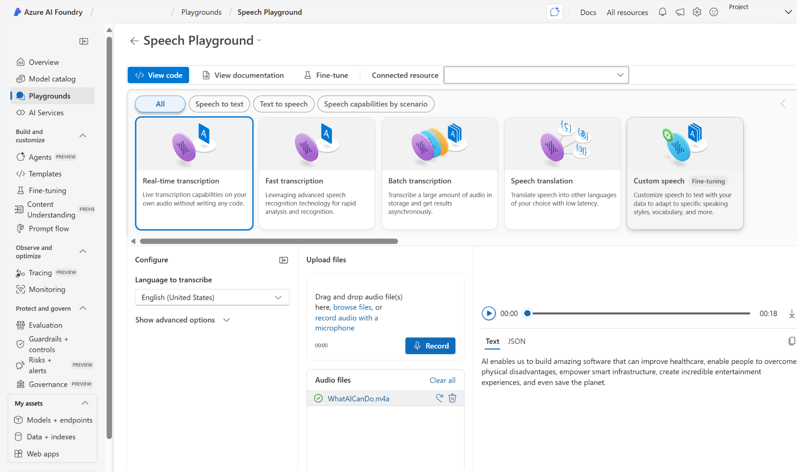

Microsoft Foundry에서 음성 시작

# 음성 인식 및 합성 이해

음성 인식은 말한 말을 받아 처리할 수 있는 데이터로 기록합니다. 이는 종종 말을 텍스트로 기록하는 작업을 통해 이루어집니다. 말해진 단어는 오디오 파일의 녹음된 음성 또는 마이크에서 나오는 라이브 오디오 형식이 될 수 있습니다. 음성 패턴은 오디오에서 분석되어 단어에 매핑되는 인식 가능한 패턴을 결정합니다. 이를 달성하기 위해 소프트웨어는 일반적으로 다음을 포함한 여러 모델을 사용합니다.

  * 오디오 신호를 음소(특정 사운드를 나타내는 단위)로 변환하는 ‘음향’ 모델.
  * 음소를 단어로 매핑하는 ‘언어’ 모델(일반적으로 음소에 따라 가장 가능성이 높은 단어 시퀀스를 예측하는 통계 알고리즘 사용).

인식된 단어는 일반적으로 다음과 같이 다양한 목적에 사용할 수 있는 텍스트로 변환됩니다.

  * 녹화된 동영상 또는 라이브 비디오에 대한 자막 제공
  * 전화 통화 또는 회의 내용 대본 만들기
  * 자동화된 메모 받아쓰기
  * 추가 처리를 위해 의도한 사용자 입력 결정

음성 합성은 일반적으로 텍스트를 음성으로 변환하여 데이터를 음성으로 표현하는 것과 관련이 있습니다. 음성 합성 솔루션에는 일반적으로 다음 정보가 필요합니다.

  * 읽을 텍스트
  * 말을 음성화하는 데 사용할 음성

음성을 합성하기 위해 시스템은 일반적으로 텍스트를 ‘토큰화’하여 개별 단어로 분할하고 각 단어에 음성 발음을 할당합니다. 그런 다음 오디오 형식으로 변환될 음소를 만들기 위해 음성 전사를 ‘운율’ 단위(예: 구, 절 또는 문장)로 세분화합니다. 이러한 음소는 오디오로 합성되고 특정 음성, 말하는 속도, 음높이, 볼륨이 할당될 수 있습니다.

다음과 같이 다양한 목적으로 음성 합성의 출력을 사용할 수 있습니다.

  * 사용자 입력에 대한 음성 응답 생성
  * 전화 시스템을 위한 음성 메뉴 만들기
  * 핸즈프리 시나리오에서 메일 또는 문자 메시지를 소리 내어 읽기
  * 기차역 또는 공항과 같은 공공장소에서 공지 사항 방송

# Azure에서 음성 시작

Microsoft Azure는 다음을 비롯한 많은 기능을 지원하는 Azure Speech Service를 통해 음성 인식 및 합성 기능을 제공합니다.

  * 음성 텍스트 변환
  * 텍스트 음성 변환
  * 음성 번역

## 음성 텍스트 변환

Azure Speech to text API를 사용하여 텍스트 형식으로 오디오의 실시간 또는 일괄 처리 전사를 수행할 수 있습니다. 전사용 오디오 소스는 마이크 또는 오디오 파일에서 나오는 실시간 오디오 스트림일 수 있습니다.

Azure AI의 음성 텍스트 변환 API는 Microsoft의 유니버설 언어 모델을 기반으로 합니다. 모델의 데이터는 Microsoft 소유이며 Azure에 배포됩니다. 이 모델은 대화 및 받아쓰기라는 두 가지 시나리오에 최적화되어 있습니다. 또한 Microsoft의 미리 빌드된 모델이 필요한 것을 제공하지 않는 경우 음향, 언어 및 발음을 비롯한 사용자 지정 모델을 만들고 학습시킬 수 있습니다.

실시간 전사: 실시간 음성 텍스트 변환을 사용하면 오디오 스트림을 텍스트로 전사할 수 있습니다. 프레젠테이션, 데모 또는 사람이 말하는 다른 모든 시나리오에 실시간 전사를 사용할 수 있습니다.

실시간 대화 내용 기록이 작동하려면 마이크에서 수신 오디오 또는 오디오 파일과 같은 다른 오디오 입력 원본을 애플리케이션에서 수신 대기할 수 있어야 합니다. 애플리케이션 코드는 오디오를 서비스로 스트리밍하여 전사된 텍스트를 반환합니다.

일괄 대화 내용 기록: 모든 음성 텍스트 변환 시나리오가 실시간인 것은 아닙니다. 파일 공유, 원격 서버 또는 Azure Storage에 오디오 녹음이 저장되어 있을 수 있습니다. SAS(공유 액세스 서명) URI가 있는 오디오 파일을 가리키고 비동기적으로 전사 결과를 받을 수 있습니다.

일괄 작업이 ‘최선의 노력 기준’으로 예약되므로 전사 일괄 처리는 비동기 방식으로 실행해야 합니다. 일반적으로 작업은 요청 후 몇 분 이내에 실행을 시작하지만 작업이 실행 상태로 전환되는 시점에 대한 예상은 없습니다.

## 텍스트 음성 변환

텍스트 음성 변환 API를 사용하면 텍스트 입력을 가청 음성으로 변환할 수 있으며, 이를 컴퓨터 스피커를 통해 직접 재생하거나 오디오 파일에 쓸 수 있습니다.

음성 합성 목소리: 텍스트 음성 변환 API를 사용하는 경우 텍스트를 발음하는 데 사용할 음성을 지정할 수 있습니다. 이 기능을 통해 유연하게 음성 합성 솔루션을 개인화하고 개성을 부여할 수 있습니다.

이 서비스에는 여러 언어 및 지역 발음을 지원하는 미리 정의된 여러 음성이 포함되어 있으며, 여기에는 인공신경망을 활용하여 음성 합성과 관련된 일반적인 제한 사항을 극복하는 신경망 음성을 포함하여 더 자연스러운 음성이 생성됩니다. 사용자 지정 음성을 개발하고 텍스트 음성 변환 API와 함께 사용할 수도 있습니다.

## 음성 번역

Azure Speech Translation은 Azure Speech Service의 기능입니다. Azure Speech Translation을 사용하면 오디오 스트림의 입력을 받고 지정된 언어로 텍스트를 반환하여 음성 언어를 실시간으로 번역할 수 있습니다. 먼저 ASR(자동 음성 인식)을 사용하여 음성을 텍스트로 변환한 다음, 기계 번역을 사용하여 인식된 텍스트를 하나 이상의 대상 언어로 변환하여 작동합니다. 이 서비스는 광범위한 원본 및 대상 언어를 지원하며 번역을 텍스트 또는 합성된 음성으로 전달할 수 있습니다. 개발자는 REST API 또는 SDK를 사용하여 이 기능을 애플리케이션에 통합할 수 있습니다. 이러한 애플리케이션은 다국어 모임, 라이브 이벤트 캡션 또는 글로벌 고객 지원과 같은 시나리오에서 잘 작동합니다.

# Azure Speech 사용

Azure Speech 는 다음을 비롯한 여러 도구 및 프로그래밍 언어를 통해 사용할 수 있습니다.

  * 스튜디오 인터페이스
  * [CLI(명령줄 인터페이스)](https://www.google.com/url?q=https://learn.microsoft.com/ko-kr/azure/ai-services/speech-service/spx-overview&sa=D&source=editors&ust=1766978491450866&usg=AOvVaw3Cp44f9QiyAXnE8MioyAiR)
  * REST API 및 [SDK(소프트웨어 개발 키트)](https://www.google.com/url?q=https://learn.microsoft.com/ko-kr/azure/ai-services/speech-service/speech-sdk&sa=D&source=editors&ust=1766978491451131&usg=AOvVaw2eNjStld_jdXOAI1RiaN1T)

## 스튜디오 인터페이스

Microsoft Foundry 포털의 Speech Playground를 사용하여 Azure Speech 프로젝트를 만들 수 있습니다.

## Azure Speech용 Azure 리소스

애플리케이션에서 Azure Speech를 사용하려면 Azure 구독에 적절한 리소스를 만들어야 합니다. 선택에 따라 다음과 같은 종류의 리소스 중 하나를 만들 수 있습니다.

  * Speech 리소스 \- Azure Speech만 사용하려는 경우 또는 리소스에 대한 액세스 및 청구를 다른 서비스와 별도로 관리하려는 경우 이 리소스 유형을 선택합니다.
  * Foundry 도구 리소스 \- 다른 Foundry 도구와 함께 Azure Speech를 사용하려는 경우 이 리소스 유형을 선택하고 이러한 서비스에 대한 액세스 및 청구를 함께 관리하려고 합니다.

1\. Azure Speech를 사용하여 전화 통화의 오디오 녹음을 텍스트로 전사한 다음, 기록된 텍스트를 Azure Language에 제출하여 핵심 구를 추출하는 애플리케이션을 빌드할 계획입니다. 단일 Azure 리소스에서 애플리케이션 서비스에 대한 액세스 및 요금 청구를 관리하려고 합니다. 어떤 종류의 Azure 리소스를 만들어야 할까요?

주조 도구

2\. Azure Speech Service를 사용하여 들어오는 전자 메일 메시지 제목을 소리 내어 읽는 애플리케이션을 빌드하려고 합니다. 사용해야 하는 API는 무엇인가요?

텍스트 음성 변환

3\. Azure Speech to text API의 주요 기능은 무엇인가요?

오디오의 실시간 또는 일괄 대화 내용 기록을 텍스트 형식으로 변환합니다.
