Microsoft Foundry에서 Computer Vision 시작

Computer Vision은 컴퓨터가 이미지, 비디오 및 라이브 카메라 피드와 같은 세계의 시각적 정보를 해석하고 이해할 수 있게 해주는 AI(인공 지능) 분야입니다. Computer Vision 기능은 시간이 많이 걸리는 작업의 자동화를 지원하며 이전에는 존재하지 않았던 가능성을 가능하게 합니다.

다음 컴퓨터 비전 애플리케이션 중 일부를 고려합니다.

  * 제조 – 결함 감지: AI 비전 시스템은 어셈블리 라인에서 제품을 실시간으로 검사합니다. 개체 감지 및 이미지 구분을 사용하여 표면 결함, 잘못 정렬 또는 누락된 구성 요소를 감지하여 폐기물을 줄이고 품질 관리를 개선합니다.
  * 의료 – 의료 이미징 분석: 컴퓨터 비전은 방사선 전문의가 X선, MRI 및 CT 스캔을 분석하는 데 도움이 됩니다. AI 모델은 종양이나 골절과 같은 변칙을 강조 표시하고, 조기 진단을 지원하고, 인간의 오류를 줄일 수 있습니다.
  * 소매점 – 선반 모니터링: 소매점은 AI 비전을 사용하여 매장 선반을 모니터링합니다. 카메라는 제품이 재고가 없거나 위치가 잘못된 경우를 감지하여 실시간 재고 업데이트를 가능하게 하고 고객 환경을 개선합니다.
  * 교통 – 자율 주행 차량: 자율 주행 자동차는 컴퓨터 비전을 사용하여 도로 표지판, 차선 표시, 보행자 및 기타 차량을 인식합니다. 이렇게 하면 동적 환경에서 안전한 탐색 및 의사 결정을 수행할 수 있습니다.

AI 비전 시스템은 다양한 Foundry 도구를 사용하여 만들 수 있습니다. 이 모듈에서는 개발자가 다양한 컴퓨터 비전 솔루션을 만드는 데 사용할 수 있는 클라우드 서비스인 Azure Vision을 살펴봅니다.

# 컴퓨터 비전용 Foundry 도구 이해

Azure AI는 컴퓨터 비전을 비롯한 다양한 AI 작업을 위한 광범위한 클라우드 기반 서비스를 제공합니다. Microsoft의 Azure Vision 서비스는 딥 러닝 모델을 기반으로 하며 다양한 기능을 제공하는 미리 빌드되고 사용자 지정 가능한 컴퓨터 비전 모델을 제공합니다. Azure Vision은 즉시 사용 가능한 기능으로 많은 일반적인 컴퓨터 비전 시나리오를 지원하며, 사용자 자신의 이미지를 사용하여 사용자 지정 모델을 만들 수 있는 능력을 유지합니다.

Azure Vision 서비스에는 여러 제품이 포함되어 있습니다. Azure Vision 내에는 다음을 비롯한 특정 작업 집합을 처리하는 서비스가 있습니다.

  * Azure Vision Image Analysis Service: 이미지에서 일반적인 개체를 검색하고, 시각적 기능에 태그를 지정하고, 캡션을 생성하고, OCR(광학 문자 인식)을 지원합니다. 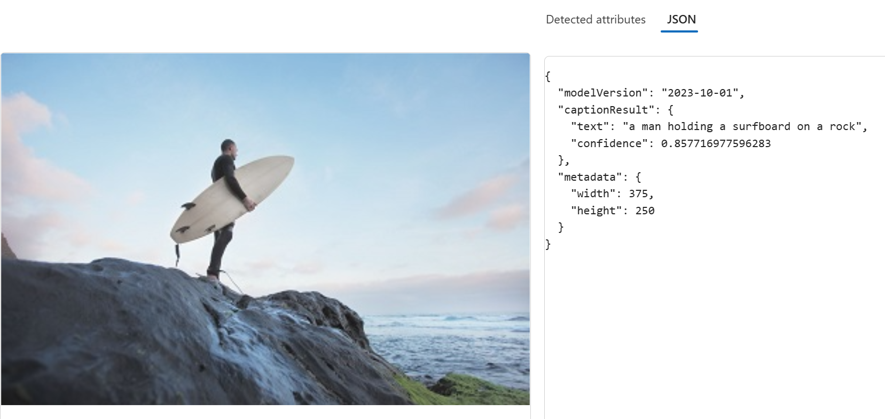
  * Azure AI Face 서비스: 이미지에서 사람의 얼굴을 감지, 인식 및 분석합니다. 이미지 분석에서 사용할 수 있는 것 이상으로 확장되는 얼굴 분석을 위한 특정 모델을 제공합니다. 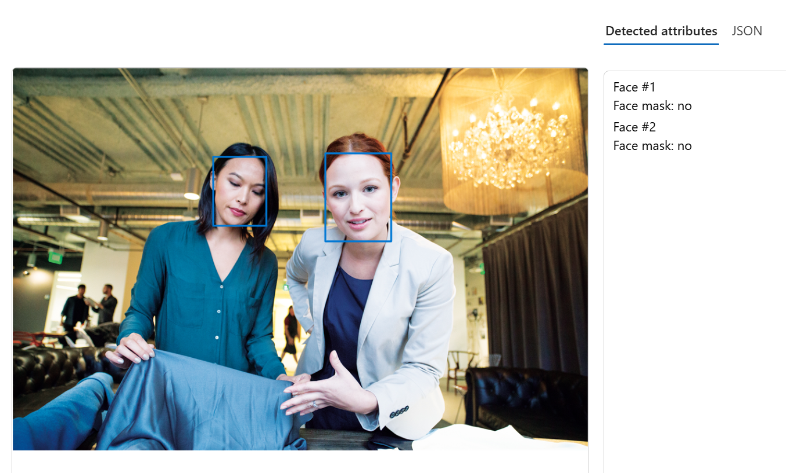

Azure Vision의 이미지 분석 및 얼굴 감지, 분석 및 인식을 위한 많은 애플리케이션이 있습니다. 다음은 그 예입니다.

  * 검색 엔진 최적화 \- 검색 순위의 필수 향상을 위해 이미지 태그 지정 및 캡션을 사용합니다.
  * 콘텐츠 조정 \- 이미지 검색을 사용하여 온라인에 게시된 이미지의 안전을 모니터링합니다.
  * 보안 \- 얼굴 인식은 보안 애플리케이션을 빌드하고 운영 체제에서 디바이스 잠금을 해제하는 데 사용할 수 있습니다.
  * 소셜 미디어 \- 얼굴 인식을 사용하여 사진에서 알려진 친구를 자동으로 태그 지정할 수 있습니다.
  * 실종자 \- 공공 카메라 시스템과 얼굴 인식을 사용하여 실종자가 이미지 프레임에 있는지 식별할 수 있습니다.
  * 신원 확인 \- 특별 입국 허가서를 소유하고 있는지 파악해야 하는 입국 키오스크 창구에서 유용합니다.
  * 박물관 아카이브 관리 \- 광학 문자 인식을 사용하여 종이 문서의 정보를 보존합니다.

 참고 항목

많은 최신 비전 솔루션은 기능의 조합으로 빌드됩니다. 예를 들어 비디오 분석 기능은 [Azure AI Video Indexer](https://www.google.com/url?q=https://learn.microsoft.com/ko-kr/azure/azure-video-indexer/video-indexer-overview&sa=D&source=editors&ust=1766978491478980&usg=AOvVaw2hSJCNaOBNXCeNEWYoAU9R)에서 지원됩니다. Azure AI Video Indexer는 Face, Translator, Image Analysis 및 Speech와 같은 여러 Foundry 도구를 기반으로 합니다.

다음으로, 몇 가지 핵심 Azure Vision 이미지 분석 기능을 살펴보겠습니다.

# Azure Vision 이미지 분석 기능 이해

Azure Vision의 이미지 분석 기능은 사용자 지정 여부에 관계없이 사용할 수 있습니다. 사용자 지정이 필요하지 않은 기능 중 일부는 다음과 같습니다.

  * 캡션이 있는 이미지 설명
  * 이미지에서 일반적인 개체 검색
  * 시각적 기능 태그 지정
  * 광학 인식

### 캡션이 있는 이미지 설명

Azure Vision에는 이미지를 분석하고, 이미지를 평가하고, 이미지에 대한 사람이 읽을 수 있는 설명을 생성하는 기능이 있습니다. 예를 들어 다음 이미지를 고려합니다.

Azure Vision은 이 이미지에 대해 다음 캡션을 반환합니다.

스케이트보드를 타고 점프하는 사람

### 이미지에서 일반적인 개체 검색

Azure Vision은 이미지에서 수천 개 공통 개체를 식별할 수 있습니다. 예를 들어 이전에 설명한 스케이트보더 이미지에서 개체를 검색하는 데 사용되는 경우 Azure Vision은 다음 예측을 반환합니다.

  * 스케이트보드(90.40%)
  * Person (95.5%)

예측에는 모델이 이미지에 실제로 무엇이 있는지를 설명하는 것이 얼마나 확실한지를 나타내는 신뢰도 점수 가 포함됩니다.

검색된 개체 레이블 및 해당 확률 외에도 Azure Vision은 검색된 개체의 위쪽, 왼쪽, 너비 및 높이를 나타내는 경계 상자 좌표를 반환합니다. 이러한 좌표를 사용하여 이미지에서 각 개체가 검색된 위치를 다음과 같이 확인할 수 있습니다.

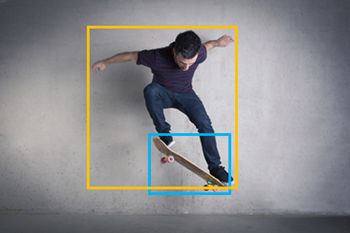

### 시각적 기능 태그 지정

Azure Vision은 내용에 따라 이미지에 대한 태그 를 제안할 수 있습니다. 태그는 이미지와 메타데이터로 연결됩니다. 태그는 이미지의 특성을 요약합니다. 태그를 사용하여 검색 솔루션에 대한 키 용어 집합과 함께 이미지를 인덱싱할 수 있습니다.

예를 들어 스케이트보더 이미지에 대해 반환된 태그(연결된 신뢰도 점수 포함)는 다음과 같습니다.

  * 스포츠 (99.60%)
  * 사람 (99.56%)
  * 신발 (98.05%)
  * 스케이트 (96.27%)
  * boardsport (95.58%)
  * 스케이트 보드 장비 (94.43%)
  * 의류(94.02%)
  * 벽(93.81%)
  * 스케이트보드 (93.78%)
  * 스케이트보더(93.25%)
  * 개별 스포츠(92.80%)
  * 거리 묘기(90.81%)
  * 잔액(90.81%)
  * 점프하기 (89.87%)
  * 스포츠 장비 (88.61%)
  * 익스트림 스포츠 (88.35%)
  * kickflip (88.18%)
  * 스턴트(87.27%)
  * 스케이트보드(86.87%)
  * 스턴트 연기자 (85.83%)
  * 무릎(85.30%)
  * 스포츠 (85.24%)
  * 롱보드(84.61%)
  * 롱보드(84.45%)
  * 승차(73.37%)
  * 스케이트 (67.27%)
  * 공기(64.83%)
  * young (63.29%)
  * 야외 (61.39%)

### 광학 인식

Azure Vision 서비스는 OCR(광학 문자 인식) 기능을 사용하여 이미지에서 텍스트를 검색할 수 있습니다. 예를 들어 식료품점의 제품에 있는 영양 라벨의 다음 이미지를 고려해 보세요.

Azure Vision 서비스는 이 이미지를 분석하고 다음 텍스트를 추출할 수 있습니다.

Nutrition Facts Amount Per Serving

Serving size:1 bar (40g)

Serving Per Package: 4

Total Fat 13g

Saturated Fat 1.5g

Amount Per Serving

Trans Fat 0g

calories 190

Cholesterol 0mg

ories from Fat 110

Sodium 20mg

ntDaily Values are based on

Vitamin A 50

calorie diet

## 사용자 지정 모델 학습

Azure Vision에서 제공하는 기본 제공 모델이 요구 사항을 충족하지 않는 경우 서비스를 사용하여 이미지 분류 또는 개체 검색을 위한 사용자 지정 모델을 학습할 수 있습니다. Azure Vision은 미리 학습된 기본 모델을 기반으로 사용자 지정 모델을 빌드합니다. 즉, 비교적 적은 수의 학습 이미지를 사용하여 정교한 모델을 학습할 수 있습니다.

### 이미지 분류

이미지 분류 모델은 이미지의 범주 또는 클래스 를 예측하는 데 사용됩니다. 예를 들어 다음과 같이 이미지에 표시되는 과일 유형을 결정하는 모델을 학습시킬 수 있습니다.

Apple| 바나나| 오렌지  
---|---|---  
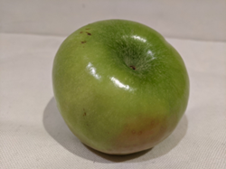| 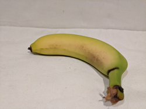| 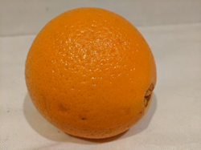  
  
### 객체 탐지

개체 검색 모델은 이미지에서 개체를 검색하고 분류하여 경계 상자 좌표를 반환하여 각 개체를 찾습니다. Azure Vision의 기본 제공 개체 검색 기능 외에도 사용자 고유의 이미지를 사용하여 사용자 지정 개체 검색 모델을 학습시킬 수 있습니다. 예를 들어 다음과 같이 과일 사진을 사용하여 이미지에서 여러 과일을 감지하는 모델을 학습시킬 수 있습니다.

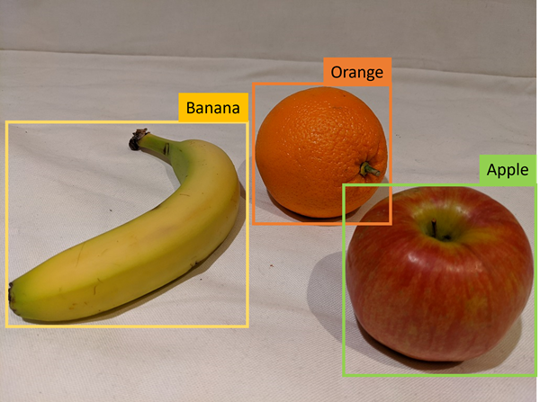

 참고 항목

Azure Vision을 사용하여 사용자 지정 모델을 학습시키는 방법에 대한 세부 정보는 이 모듈의 범위를 벗어납니다. [Azure Vision 설명서](https://www.google.com/url?q=https://learn.microsoft.com/ko-kr/azure/ai-services/computer-vision/how-to/model-customization?tabs%3Dpython&sa=D&source=editors&ust=1766978491487523&usg=AOvVaw0xt4ID3zrc0s_vTJI72LW9)에서 사용자 지정 모델 학습에 대한 정보를 찾을 수 있습니다.

# Azure Vision의 Face 서비스 기능 이해

Azure Vision 내의 제품인 Azure AI Face 는 사용자 ID 확인, 활동성 감지, 터치리스 액세스 제어 및 얼굴 편집과 같은 특정 사용 사례를 지원합니다. 얼굴 감지 및 인식을 비롯한 몇 가지 개념은 Face 작업에 필수적입니다.

## 얼굴 감지

얼굴 감지에는 다음과 같이 일반적으로 얼굴 주위에 사각형을 형성하는 경계 상자 좌표를 반환하여 사람의 얼굴을 포함하는 이미지 영역을 식별하는 작업이 포함됩니다.

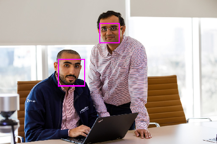

얼굴 기능을 사용하면 얼굴 특징을 사용하여 코, 눈, 눈썹, 입술 등과 같은 다른 정보를 반환하도록 기계 학습 모델을 학습시킬 수 있습니다.

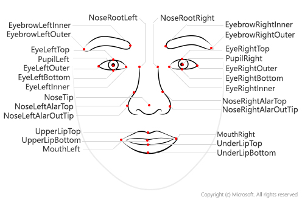

## 얼굴 인식

얼굴 분석의 또 한 가지 응용 분야는 얼굴 특징에서 알려진 개인을 식별하도록 기계 학습 모델을 학습시키는 것입니다. 이를 얼굴 인식이라고하며, 개인의 여러 이미지를 사용하여 모델을 학습합니다. 이렇게 하면 모델이 학습되지 않은 새 이미지에서 해당 개인을 감지할 수 있도록 모델을 학습합니다.

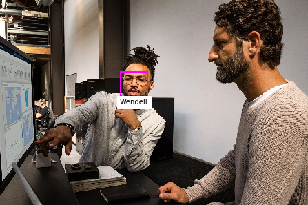

책임 있게 사용하는 경우 얼굴 인식은 효율성, 보안, 고객 환경을 향상시킬 수 있는 중요하고 유용한 기술입니다.

## Azure AI Face 서비스 기능

Azure AI Face 서비스는 이미지에서 발견된 모든 사람 얼굴에 대한 사각형 좌표와 일련의 관련 특성을 반환할 수 있습니다.

  * 액세서리: 지정된 얼굴에 액세서리가 있는지 여부를 나타냅니다. 이 속성은 각각 0과 1 사이의 신뢰도 점수를 가진 모자, 안경 및 마스크를 포함한 가능성 있는 액세서리를 반환합니다.
  * 얼굴 흐림: 얼굴이 얼마나 흐릿하게 보이는지를 나타내며, 이것은 얼굴이 이미지의 주요 초점이 될 가능성을 시사할 수 있습니다.
  * 노출: 이미지가 노출 부족인지 과다 노출인지 여부를 나타냅니다. 이는 전체 이미지 노출이 아닌 이미지의 얼굴에 적용됩니다.
  * 안경: 인물이 안경을 쓰고 있는지 여부를 나타냅니다.
  * 머리 자세: 3차원 공간에서의 얼굴 방향입니다.
  * 마스크: 얼굴의 마스크 착용 여부를 나타냅니다.
  * 노이즈: 이미지상 시각적 노이즈를 의미합니다. 어두운 설정을 위해 높은 ISO 설정으로 사진을 촬영한 경우 이미지에 노이즈가 보일 것입니다. 이미지가 거칠어 보이거나 명확성이 떨어지는 작은 점들로 이루어진 것처럼 보입니다.
  * 가림: 이미지에서 얼굴을 가리는 요소가 있는지 확인합니다.
  * 인식 품질: 얼굴 인식을 시도하기에 이미지의 품질이 충분한지 여부를 나타내는 높음, 보통, 낮음 등급입니다.

## 책임 있는 AI 사용

 Important

Microsoft의 [책임 있는 AI 표준을](https://www.google.com/url?q=https://blogs.microsoft.com/on-the-issues/2022/06/21/microsofts-framework-for-building-ai-systems-responsibly/&sa=D&source=editors&ust=1766978491491211&usg=AOvVaw2mrzeyz2PPcUs5ARzsKaNO) 지원하기 위해 Azure AI Face 및 Azure Vision에는 [제한된 액세스 정책이](https://www.google.com/url?q=https://aka.ms/AAh91ff&sa=D&source=editors&ust=1766978491491374&usg=AOvVaw14AnXCT8S_s3srxwIgmOdu) 있습니다.

누구나 Face 서비스를 사용하여 다음 작업을 수행할 수 있습니다.

  * 이미지에서 얼굴의 위치를 감지합니다.
  * 사람이 안경을 쓰고 있는지 확인합니다.
  * 얼굴에 가림, 흐림, 노이즈 또는 과다/과소 노출이 있는지 확인합니다.
  * 이미지상 각 얼굴의 머리 자세 좌표를 반환합니다.

제한된 액세스 정책에 따라 고객은 다음을 포함한 추가 Azure AI Face 서비스 기능에 액세스하려면 [접수 양식을 제출](https://www.google.com/url?q=https://aka.ms/facerecognition&sa=D&source=editors&ust=1766978491492095&usg=AOvVaw0rGndlzHJdCTGIJ1JnE3m9)해야 합니다.

  * 얼굴 검증: 얼굴의 유사성을 비교하는 기능입니다.
  * 얼굴 식별: 이미지 속에서 이름이 있는 개인을 식별하는 기능입니다.
  * 라이브니스 탐지: 반복 콘텐츠 및/또는 정책 위반을 나타내는 동작을 탐지하고 이를 완화하는 기능 (예: 입력 비디오 스트림이 실제인지 가짜인지 여부).

# Microsoft Foundry 포털에서 시작

Azure Vision은 비전 기능을 애플리케이션에 통합하기 위한 구성 요소를 제공합니다. 여러 Foundry 도구 중 하나로서 다음과 같은 여러 가지 방법으로 Azure Vision을 사용하여 솔루션을 만들 수 있습니다.

  * Microsoft Foundry 포털
  * SDK(소프트웨어 개발 키트) 또는 REST API

## Azure Vision 서비스에 대한 Azure 리소스

Azure Vision을 사용하려면 Azure 구독에서 리소스를 만들어야 합니다. 다음 리소스 종류 중 하나를 사용할 수 있습니다.

  * Azure Vision: Azure Vision 서비스에 대한 특정 리소스입니다. 다른 Foundry 도구를 사용하지 않으려는 경우 또는 Azure Vision 리소스에 대한 사용률 및 비용을 별도로 추적하려는 경우 이 리소스 유형을 사용합니다.
  * Foundry 도구: Azure Vision을 비롯해 Azure Language, Azure AI 커스텀 비전, Azure Translator 등 다양한 Foundry 도구를 포함하는 일반적인 리소스입니다. 여러 AI 서비스를 사용하려는 경우 관리 및 개발을 간소화하려는 경우 이 리소스 유형을 사용합니다.

 참고 항목

Azure를 사용하여 리소스를 만드는 방법에는 여러 가지가 있습니다. 사용자 인터페이스를 사용하여 리소스를 만들거나 스크립트를 작성할 수 있습니다. Azure Portal과 Microsoft Foundry 포털은 모두 리소스를 만들기 위한 사용자 인터페이스를 제공합니다. 실행 중인 Foundry 도구의 예제를 보려면 Microsoft Foundry 포털을 선택합니다.

## Microsoft Foundry 포털에서 시작

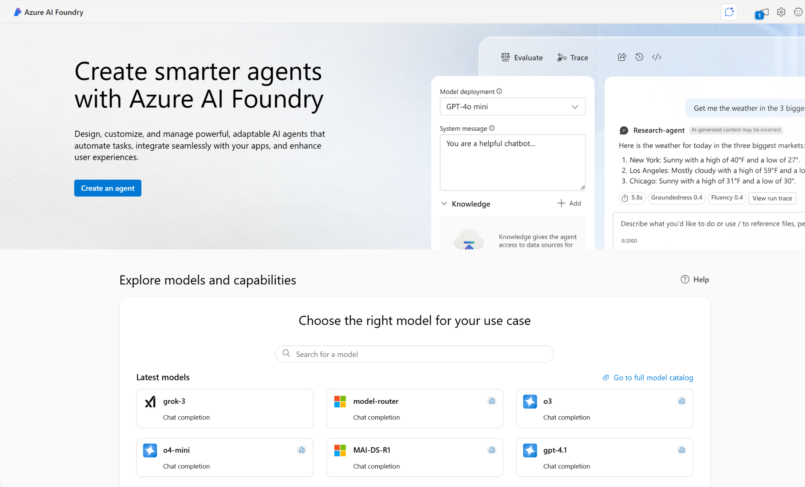

Microsoft Foundry는 엔터프라이즈 AI 운영, 모델 작성기 및 애플리케이션 개발을 위한 통합 플랫폼을 제공합니다. Microsoft Foundry 포털은 허브 및 프로젝트를 기반으로 하는 사용자 인터페이스를 제공합니다. Azure Vision을 비롯한 Foundry 도구를 사용하려면 Microsoft Foundry에서 프로젝트를 만들면 Foundry 도구 리소스도 만들어 줍니다.

Microsoft Foundry의 프로젝트는 작업 및 리소스를 효과적으로 구성하는 데 도움이 됩니다. 프로젝트는 데이터 세트, 모델 및 기타 리소스에 대한 컨테이너 역할을 하므로 AI 솔루션을 보다 쉽게 관리하고 공동 작업할 수 있습니다.

Microsoft Foundry 포털 내에서 샘플 이미지로 테스트하거나 직접 업로드하여 서비스 기능을 사용해 볼 수 있습니다.

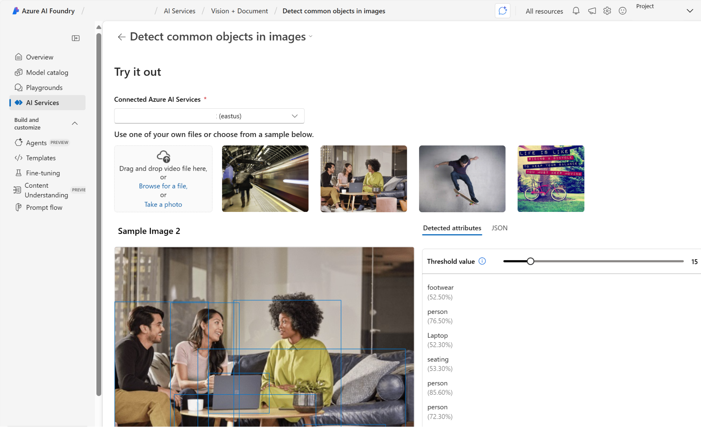

1\. Azure Vision 서비스를 사용하여 이미지에서 개별 항목의 위치를 식별하려고 합니다. 다음 중 검색해야 하는 기능은 무엇입니까?

개체

2\. Face 서비스는 이미지에서 얼굴의 위치를 어떻게 나타내나요?

얼굴 주변의 사각형 경계 상자를 정의하는 각 얼굴의 좌표 집합

3\. 다음 중 Azure Vision용 Microsoft Foundry 포털을 사용하면 어떤 이점이 있나요?

AI 서비스를 구성하고 테스트하는 허브 및 프로젝트가 있는 사용자 인터페이스를 제공합니다.

Azure Vision은 딥 러닝으로 구동되는 미리 빌드된 컴퓨터 비전 모델과 사용자 지정 가능한 컴퓨터 비전 모델을 모두 제공하는 클라우드 기반 서비스입니다. 개체 감지, 이미지 태그 지정, 캡션 생성 및 OCR(광학 문자 인식)을 비롯한 다양한 작업을 지원합니다. 서비스는 특수 구성 요소로 나뉩니다.

  * 이미지 분석: 개체를 검색하고, 기능을 태그로 지정하고, 캡션을 생성하고, OCR을 수행합니다.
  * Face Service: 고급 얼굴 인식 기능을 사용하여 사람의 얼굴을 감지하고 분석합니다.

이러한 도구는 SEO 최적화, 콘텐츠 조정, 보안 시스템, 소셜 미디어 태그 지정, ID 유효성 검사 및 디지털 보관과 같은 실제 애플리케이션에서 사용됩니다. Microsoft Foundry 포털에서 Azure Vision을 시작할 수 있습니다.

 팁

[서비스 설명서](https://www.google.com/url?q=https://learn.microsoft.com/ko-kr/azure/ai-services/computer-vision/overview&sa=D&source=editors&ust=1766978491497374&usg=AOvVaw0Vpvace4zIZ2OFh9k8b4Zs)에서 Azure Vision 서비스를 사용하는 방법에 대해 자세히 알아볼 수 있습니다.
