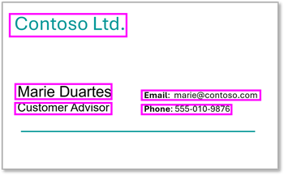
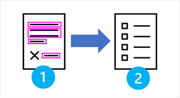
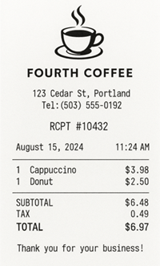
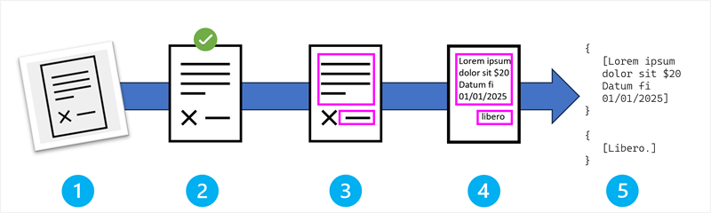
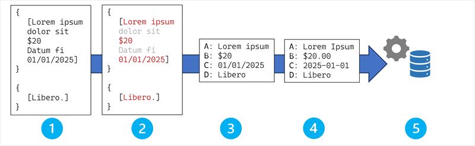

AI 기반 정보 추출 개념 소개

# 소개

AI 정보 추출 솔루션은 일반적으로 문서, 이미지, 비디오 및 오디오 녹음과 같은 구조화되지 않은 미디어에서 구조화된 데이터 필드를 추출하는 데 사용됩니다.

 참고 항목

이 모듈의 문서 및 이미지에서 정보 추출에 집중하지만 음성 인식 및 기타 고급 기술을 사용하여 비디오 및 오디오 녹음과 같은 다양한 미디어 형식에서 정보를 추출하는 AI 솔루션이 등장하고 있습니다.

정보 추출 시나리오는 명함 사진에서 연락처 정보를 읽을 수 있는 간단한 앱부터 재무 및 법률 문서를 분석하고 처리하는 매우 복잡한 비즈니스 워크플로 자동화 시스템에 이르기까지 다양합니다.

정보 추출 시나리오의 몇 가지 일반적인 예는 다음과 같습니다.

### 재무 문서 처리

청구서 처리 솔루션은 청구서를 분석하여 추출할 수 있습니다.

  * 공급업체 정보: 회사 이름, 주소 및 연락처 세부 정보입니다.
  * 트랜잭션 세부 정보: 송장 번호, 날짜 및 지불 조건.
  * 품목: 제품 설명, 수량, 단가 및 합계입니다.
  * 세금 정보: 세율, 금액 및 면제 항목.

영수증 처리 솔루션은 추출하기 위해 영수증을 읽어야 할 수 있습니다.

  * 판매자 세부 정보: 스토어 이름, 위치 및 트랜잭션 ID.
  * 구매 정보: 구매한 항목, 가격 및 할인.
  * 결제 세부 정보: 결제 방법, 변경 금액 및 로열티 포인트.

재무제표는 다음을 추출하도록 처리할 수 있습니다.

  * 계정 정보: 계정 번호, 잔액 및 트랜잭션 기록입니다.
  * 성능 메트릭: 수익, 비용 및 이익 마진.
  * 규정 준수 데이터: 규정 보고 필드 및 감사 내역 정보입니다.

### 법률 및 규정 준수 문서

계약 처리 솔루션을 사용하여 추출할 수 있습니다.

  * 당사자 정보: 계약 당사자, 서명자 및 증인.
  * 사용 약관: 유효 날짜, 갱신 약관 및 종료 조항.
  * 재무 조건: 지불 일정, 페널티 및 보험 요구 사항.

처리해야 할 수 있는 규정 양식은 다음과 같습니다.

  * 세금 문서: W-2s, 1099s 및 기타 세금 양식.
  * 보험 양식: 정책 번호, 청구 금액 및 인시던트 세부 정보.
  * 정부 양식: 애플리케이션 데이터 및 인증 요구 사항.

### 의료 문서

의료 레코드 를 처리하여 검색할 수 있습니다.

  * 환자 정보: 인구 통계, 의료 기록 번호 및 보험 세부 정보.
  * 임상 데이터: 진단, 치료, 약물 목록 및 활력 징후.
  * 관리 데이터: 약속 일정, 청구 코드 및 공급자 정보입니다.

### 공급망 및 물류

배송 문서에 는 다음과 같은 중요한 세부 정보가 포함되어 있는 경우가 많습니다.

  * 배송 세부 정보: 운송장 번호, 중량, 크기 및 치수
  * 주소 정보: 보낸 사람 및 받는 사람 세부 정보 및 배달 지침입니다.
  * 세관 설명서: 상품 코드, 값 및 지리적 출처.

구매 주문은 일반적으로 정보를 추출하기 위해 처리됩니다.

  * 공급업체 정보: 공급업체 세부 정보 및 연락처 정보입니다.
  * 제품 사양: 항목 코드, 설명 및 수량입니다.
  * 배달 요구 사항: 일정, 위치 및 특별 지침.

AI를 사용하여 정보를 추출하는 것은 이러한 시나리오에 대한 워크로드 자동화 시스템의 기초가 될 수 있으며, 그 이상입니다.

 참고 항목

우리는 다른 사람들이 다른 방법으로 배우는 것을 좋아한다는 것을 알고 있습니다. 이 모듈을 비디오 기반 형식으로 완료하도록 선택하거나 콘텐츠를 텍스트 및 이미지로 읽을 수 있습니다. 텍스트는 비디오보다 더 자세한 내용을 포함하므로 경우에 따라 비디오 프레젠테이션에 대한 추가 자료로 참조할 수 있습니다.

# 정보 추출 개요

정보 추출은 여러 AI 기술을 결합하여 콘텐츠에서 데이터를 추출하는 워크로드입니다( 종종 디지털 문서). 포괄적인 정보 추출 솔루션에는 이미지 기반 데이터에서 텍스트를 검색하는 컴퓨터 비전 요소가 포함됩니다. 추출된 텍스트를 특정 데이터 필드에 의미적으로 매핑하기 위한 기계 학습 또는 점점 더 생성되는 AI

  1. OCR(광학 문자 인식)을 사용하여 이미지에서 텍스트 감지 및 추출
  2. OCR 결과에서 데이터 필드로의 값 식별 및 매핑

예를 들어 AI 기반 비용 클레임 처리 솔루션은 영수증에서 관련 필드를 자동으로 추출하여 클레임을 보다 효율적으로 처리할 수 있습니다.

스캔한 영수증| 추출된 데이터  
---|---  
| 

  * 공급업체: Fourth Coffee
  * 날짜: 2024-08-15
  * 부분합: $6.48
  * 세금: $0.49
  * 총 청구액: $6.97

  
  
## 올바른 방법 선택

정보 추출 솔루션을 계획할 때는 시스템에서 해결해야 하는 요구 사항 및 제약 조건을 고려해야 합니다. 몇 가지 주요 고려 사항은 다음과 같습니다.

  * 문서 특성입니다. 데이터를 추출해야 하는 문서는 전체 솔루션의 기초입니다. 다음과 같은 요인을 고려합니다.

  * 레이아웃 일관성: 표준화된 양식은 템플릿 기반 접근 방식을 선호하지만, 여러 형식 및 레이아웃을 처리해야 하는 경우에는 더 복잡한 기계 학습 기반 솔루션이 필요할 수 있습니다.
  * 볼륨 요구 사항: 대용량 처리는 최적화된 시스템 하드웨어에서 실행되는 자동화된 기계 학습 모델의 이점입니다.
  * 정확도 요구 사항: 중요한 애플리케이션에는 휴먼 인 더 루프 유효성 검사가 필요할 수 있습니다.

  * 기술 인프라 요구 사항 및 제약 조건 솔루션을 실행하려면 하드웨어 및 소프트웨어 인프라가 필요합니다. 다음과 같은 요인을 고려합니다.

  * 보안 및 개인 정보: 처리 중인 문서에 중요한 데이터 또는 기밀 데이터가 포함될 수 있습니다. 솔루션에는 데이터에 대한 액세스를 보호하고 보호된 데이터를 저장하고 처리하기 위한 업계 요구 사항을 준수하기 위한 적절한 조치가 포함되어야 합니다.
  * 처리 능력: 정보 추출 솔루션에 일반적으로 사용되는 딥 러닝 및 생성 AI 모델에는 상당한 계산 리소스가 필요합니다.
  * 대기 시간 요구 사항: 실시간 처리는 모델 복잡성을 제한할 수 있습니다.
  * 확장성 요구 사항: 클라우드 기반 솔루션은 가변 워크로드에 더 나은 확장성을 제공합니다.
  * 통합 복잡성: API 호환성 및 데이터 형식 요구 사항을 고려합니다.

 팁

대부분의 경우 Microsoft Foundry 도구의 Azure 문서 인텔리전스 및 Microsoft Foundry Tools의 Azure Content Understanding과 같은 소프트웨어 서비스를 사용하여 정보 추출 솔루션을 빌드할 수 있습니다. 이러한 서비스를 솔루션의 기초로 사용하면 확장성이 뛰어나고 업계에서 입증된 성능, 정확도 및 통합 기능을 제공하면서 필요한 개발 노력을 크게 줄일 수 있습니다.

# OCR(광학 문자 인식)

OCR(광학 문자 인식)은 스캔한 문서, 사진 또는 디지털 파일 등 이미지의 시각적 텍스트를 편집 가능하고 검색 가능한 텍스트 데이터로 자동으로 변환하는 기술입니다. OCR은 정보를 수동으로 전사하는 대신 다음에서 자동화된 데이터 추출을 가능하게 합니다.

  * 스캔한 청구서 및 영수증
  * 문서의 디지털 사진
  * 텍스트 이미지가 포함된 PDF 파일
  * 스크린샷 및 캡처된 콘텐츠
  * 양식 및 필기 노트

## OCR 파이프라인: 단계별 프로세스

OCR 파이프라인은 시각적 정보를 텍스트 데이터로 변환하기 위해 함께 작동하는 다섯 가지 필수 단계로 구성됩니다.

OCR 프로세스의 단계는 다음과 같습니다.

  1. 이미지 획득 및 입력.
  2. 전처리 및 이미지 향상.
  3. 텍스트 영역 검색.
  4. 문자 인식 및 분류.
  5. 출력 생성 및 후처리.

각 단계를 좀 더 자세히 살펴보겠습니다.

### 1단계: 이미지 획득 및 입력

파이프라인은 텍스트가 포함된 이미지가 시스템에 들어갈 때 시작됩니다. 이는 다음과 같습니다.

  * 스마트폰 카메라로 찍은 사진.
  * 플랫베드 또는 문서 스캐너에서 스캔한 문서입니다.
  * 비디오 스트림에서 추출된 프레임입니다.
  * 이미지로 렌더링된 PDF 페이지입니다.

 팁

이 단계의 이미지 품질은 텍스트 추출의 최종 정확도에 크게 영향을 줍니다.

### 2단계: 전처리 및 이미지 향상

텍스트 검색을 시작하기 전에 다음 기술을 사용하여 더 나은 인식 정확도를 위해 이미지를 최적화합니다.

  * 노이즈 감소 는 시각적 아티팩트, 먼지 반점 및 텍스트 감지를 방해할 수 있는 스캔 결함을 제거합니다. 노이즈 감소를 수행하는 데 사용되는 특정 기술은 다음과 같습니다.

  * 필터링 및 이미지 처리 알고리즘: Gaussian 필터, 중앙값 필터 및 형태 연산.
  * 기계 학습 모델: 문서 이미지 정리를 위해 특별히 학습된 디노이징 자동 인코더 및 컨볼루션 신경망(CNN)

  * 대비 조정 을 사용하면 텍스트와 배경의 차이가 향상되어 문자가 더 구별됩니다. 다시 말하지만, 다음과 같은 여러 가지 방법이 있습니다.

  * 클래식 메서드: 히스토그램 균등화, 적응 임계값 및 감마 보정.
  * 기계 학습: 다양한 문서 유형에 대한 최적의 향상된 매개 변수를 학습하는 딥 러닝 모델입니다.

  * 기울이기 보정 은 문서 회전을 감지하고 수정하여 텍스트 줄이 가로로 올바르게 정렬되도록 합니다. 기울이기 수정에 대한 기술은 다음과 같습니다.

  * 수학 기술: 선 감지, 프로젝션 프로필 및 연결된 구성 요소 분석을 위한 Hough 변환입니다.
  * 신경망 모델: 이미지 기능에서 직접 회전 각도를 예측하는 회귀 CNN입니다.

  * 해상도 최적화 는 이미지 해상도를 문자 인식 알고리즘의 최적 수준으로 조정합니다. 다음을 사용하여 이미지 해상도를 최적화할 수 있습니다.

  * 보간 방법: 쌍입방, 쌍선형 및 Lanczos 다시 샘플링 알고리즘.
  * 초고해상도 모델: 저해상도 텍스트 이미지를 지능적으로 스케일 업스케일하는 GAN(생성 적대적 네트워크) 및 잔차 네트워크입니다.

### 3단계: 텍스트 영역 검색

시스템은 전처리된 이미지를 분석하여 다음 기술을 사용하여 텍스트가 포함된 영역을 식별합니다.

  * 레이아웃 분석은 텍스트 영역, 이미지, 그래픽 및 공백 영역을 구분합니다. 레이아웃 분석을 위한 기술은 다음과 같습니다.

  * 기존 방법: 연결된 구성 요소 분석, 실행 길이 인코딩 및 프로젝션 기반 세분화입니다.
  * 딥 러닝 모델: U-Net, 마스크 R-CNN 및 특수 문서 레이아웃 분석 모델(예: LayoutLM 또는 PubLayNet 학습 모델)과 같은 의미 체계 구분 네트워크입니다.

  * 텍스트 블록 식별 은 개별 문자를 공간 관계에 따라 단어, 줄 및 단락으로 그룹화합니다. 일반적인 방법은 다음과 같습니다.

  * 클래식 방법: 거리 기반 클러스터링, 공백 분석 및 형태 연산
  * 신경망: 공간 문서 구조를 이해하는 그래프 신경망 및 변환기 모델

  * 읽기 순서 결정은 텍스트를 읽어야 하는 시퀀스를 설정합니다(영어의 경우 왼쪽에서 오른쪽, 위에서 아래로). 올바른 순서는 다음을 통해 확인할 수 있습니다.

  * 규칙 기반 시스템: 경계 상자 좌표 및 공간 추론을 사용하는 기하학적 알고리즘입니다.
  * 기계 학습 모델: 학습 데이터에서 읽기 패턴을 학습하는 시퀀스 예측 모델 및 그래프 기반 접근 방식입니다.

  * 지역 분류 는 다양한 유형의 텍스트 영역(머리글, 본문 텍스트, 캡션, 표)을 식별합니다.

  * 기능 기반 분류자: 글꼴 크기, 위치 및 서식 지정과 같은 수공예 기능을 사용하여 SVM(벡터 머신) 지원
  * 딥 러닝 모델: 레이블이 지정된 문서 데이터 세트에 대해 학습된 나선형 신경망 및 비전 변환기

### 4단계: 문자 인식 및 분류

개별 문자가 식별되는 OCR 프로세스의 핵심은 다음과 같습니다.

  * 기능 추출: 각 문자 또는 기호의 모양, 크기 및 고유 특성을 분석합니다.

  * 기존 방법: 모멘트, 푸리에 설명자 및 구조적 기능(루프, 엔드포인트, 교집합)과 같은 통계 기능
  * 딥 러닝 접근 방식: 원시 픽셀 데이터에서 차별적인 기능을 자동으로 학습하는 나선형 신경망

  * 패턴 일치: 추출된 기능을 다양한 글꼴, 크기 및 쓰기 스타일을 인식하는 학습된 모델과 비교합니다.

  * 템플릿 일치: 상관 관계 기술을 사용하여 저장된 문자 템플릿과 직접 비교
  * 통계적 분류자: HMM(Hidden Markov 모델), 지원 벡터 컴퓨터, 기능 벡터를 사용하는 K 가장 인접한 항목
  * 신경망: 다중 계층 퍼셉트론, CNN 및 숫자 인식을 위한 LeNet과 같은 특수 아키텍처
  * 고급 딥 러닝: 강력한 문자 분류를 위한 잔차 네트워크(ResNet), DenseNet 및 EfficientNet 아키텍처

  * 컨텍스트 분석: 주변 문자와 단어를 사용하여 사전 조회 및 언어 모델을 통해 인식 정확도를 향상시킵니다.

  * N-gram 모델: 확률 분포를 기반으로 문자 시퀀스를 예측하는 통계 언어 모델입니다.
  * 사전 기반 수정: 맞춤법 교정을 위한 편집 거리 알고리즘(예: Levenshtein 거리)이 있는 Lexicon 조회입니다.
  * 신경망 언어 모델: 컨텍스트 관계를 이해하는 LSTM 및 변환기 기반 모델(예: BERT 변형)
  * 주의 메커니즘: 문자 예측을 수행할 때 입력의 관련 부분에 초점을 맞춘 변환기 모델입니다.

  * 신뢰도 점수 매기기: 시스템이 식별에 대해 얼마나 확실한지에 따라 인식된 각 문자에 확률 점수를 할당합니다.

  * Bayesian 접근 방식: 문자 예측의 불확실성을 정량화하는 확률적 모델입니다.
  * Softmax 출력: 신경망 최종 계층 활성화가 확률 분포로 변환됩니다.
  * 앙상블 메서드: 여러 모델의 예측을 결합하여 신뢰도 추정을 향상시킵니다.

### 5단계: 출력 생성 및 후처리

최종 단계에서는 인식 결과를 사용 가능한 텍스트 데이터로 변환합니다.

  * 텍스트 컴파일: 개별 문자 인식을 전체 단어 및 문장으로 어셈블합니다.

  * 규칙 기반 어셈블리: 공간 근접 및 신뢰도 임계값을 사용하여 문자 예측을 결합하는 결정적 알고리즘입니다.
  * 시퀀스 모델: 텍스트를 순차 데이터로 모델링하는 RNN(되풀이 신경망) 및 LSTM(Long Short-Term Memory) 네트워크입니다.
  * 주의 기반 모델: 가변 길이 시퀀스와 복잡한 텍스트 레이아웃을 처리할 수 있는 변환기 아키텍처입니다.

  * 서식 유지: 단락, 줄 바꿈 및 간격을 포함하여 문서 구조를 유지합니다.

  * 기하학적 알고리즘: 경계 상자 좌표 및 공백 분석을 사용하는 규칙 기반 시스템입니다.
  * 레이아웃 이해 모델: 구조적 관계를 학습하는 그래프 신경망 모델 및 문서 인공 지능 모델.
  * 다중 모달 변환기: 구조 유지를 위해 텍스트 및 레이아웃 정보를 결합하는 LayoutLM과 같은 모델입니다.

  * 좌표 매핑: 원본 이미지 내에서 각 텍스트 요소의 정확한 위치를 기록합니다.

  * 좌표 변환: 이미지 픽셀과 문서 좌표 간의 수학 매핑입니다.
  * 공간 인덱싱: 효율적인 공간 쿼리를 위한 R-트리 및 쿼드 트리와 같은 데이터 구조입니다.
  * 회귀 모델: 정확한 텍스트 위치 지정 좌표를 예측하도록 학습된 신경망.

  * 품질 유효성 검사: 맞춤법 및 문법 검사를 적용하여 잠재적 인식 오류를 식별합니다.

  * 사전 기반 유효성 검사: 포괄적인 단어 목록 및 특수 도메인 어휘를 조회합니다.
  * 통계 언어 모델: 문법 및 컨텍스트 유효성 검사를 위한 N-gram 모델 및 확률 파서입니다.
  * 신경망 언어 모델: OCR 오류 검색 및 수정을 위해 GPT 또는 BERT와 같은 미리 학습된 모델을 미세 조정합니다.
  * 앙상블 유효성 검사: 여러 유효성 검사 방법을 결합하여 오류 검색 정확도를 향상시킵니다.

# 필드 추출 및 매핑

필드 추출은 OCR에서 텍스트 출력을 가져와서 개별 텍스트 값을 의미 있는 비즈니스 정보에 해당하는 레이블이 지정된 특정 데이터 필드에 매핑하는 프로세스입니다. OCR은 문서에 존재하는 텍스트를 알려주지만 필드 추출은 해당 텍스트의 의미 와 비즈니스 시스템에 속하는 위치를 알려줍니다.

## 필드 추출 파이프라인

필드 추출은 OCR 출력을 구조화된 데이터로 변환하는 체계적인 파이프라인을 따릅니다.

필드 추출 프로세스의 단계는 다음과 같습니다.

  1. OCR 출력 데이터 삽입.
  2. 필드 검색 및 후보 식별.
  3. 필드 매핑 및 연결.
  4. 데이터 정규화 및 표준화.
  5. 비즈니스 프로세스 및 시스템과의 통합

이러한 단계를 좀 더 자세히 살펴보겠습니다.

### 1단계: OCR 출력 수집

프로세스는 다음을 포함할 수 있는 OCR 파이프라인의 구조적 출력으로 시작합니다.

  * 원시 텍스트 콘텐츠: 문서에서 추출된 실제 문자 및 단어
  * 위치 메타데이터: 경계 상자 좌표, 페이지 위치 및 읽기 순서 정보
  * 신뢰도 점수: 각 텍스트 요소에 대한 OCR 엔진 신뢰도 수준
  * 레이아웃 정보: 문서 구조, 줄 바꿈, 단락 경계

 참고 항목

간단한 텍스트 처리와 달리 필드 추출은 문서의 내용뿐만 아니라 텍스트가 표시되는 위치에 크게 의존합니다. "12345"의 위치는 청구서 번호, 고객 ID 또는 전화 번호인지 여부를 결정하는 데 도움이 될 수 있습니다.

### 2단계: 필드 검색 및 후보 식별

이 단계에서는 OCR 출력의 잠재적 필드 값을 식별합니다. OCR 결과에서 가능성이 있는 필드를 결정하기 위해 독립적으로 또는 조합하여 사용할 수 있는 여러 가지 방법이 있습니다.

#### 템플릿 기반 검색

필드 검색을 위한 템플릿은 규칙 기반 패턴 일치를 사용합니다. 필드 식별은 다음과 같은 기술을 사용하여 수행할 수 있습니다.

  * 알려진 필드 위치 및 앵커 키워드가 있는 미리 정의된 문서 레이아웃입니다.
  * "청구서 번호:", "Date:", "Total:"와 같은 레이블 값 쌍을 검색합니다.
  * 정규식 및 문자열 일치 알고리즘입니다.

템플릿 기반 접근 방식의 이점은 알려진 문서 형식, 빠른 처리 및 설명 가능한 결과에 대한 높은 정확도를 포함합니다.

접근 방식의 제한 사항에는 수동 템플릿 만들기에 대한 요구 사항과 레이아웃 변형 또는 필드 명명 불일치로 인한 복잡성이 포함됩니다.

#### 기계 학습 기반 검색

알려진 이름 및 위치를 기반으로 필드를 추출하는 하드 코딩된 논리 대신 예제 문서 모음을 사용하여 학습된 관계를 기반으로 필드를 추출하는 기계 학습 모델을 학습시킬 수 있습니다. 특히 변환기 기반 모델은 패턴을 식별하기 위해 상황별 신호를 적용하는 데 능숙하므로 필드 검색 솔루션의 기초가 되는 경우가 많습니다.

현장 검색 기계 학습 모델에 대한 학습 방법은 다음과 같습니다.

  * 감독 학습: 알려진 필드 위치가 있는 레이블이 지정된 데이터 세트에 대해 학습됩니다.
  * 자체 감독 학습: 레이아웃 패턴을 이해하기 위해 큰 문서 모음에서 미리 학습되었습니다.
  * 다중 모달 학습: 텍스트, 시각적 기능 및 위치적 특징을 결합합니다.
  * 고급 모델 아키텍처(예:

  * 텍스트 요소 간의 공간 관계를 그래프 연결로 모델링하는 그래프 신경망(GNN)입니다.
  * 필드 값을 예측할 때 관련 문서 영역에 초점을 맞추는 주의 메커니즘입니다.
  * 구조화되지 않은 텍스트 시퀀스를 구조화된 필드 할당으로 변환하는 시퀀스-시퀀스 모델입니다.

#### 스키마 기반 추출을 위한 생성 AI

최근 LLM(대규모 언어 모델)의 발전으로 인해 생성 AI 기반 필드 검색 기술이 등장하여 다음을 통해 보다 효율적이고 효과적인 필드 검색이 가능합니다.

  * LLM에 문서 텍스트와 스키마 정의를 제공하고 스키마의 필드와 일치하는 프롬프트 기반 추출입니다.
  * 최소한의 예제로 모델을 학습하여 사용자 지정 필드를 추출할 수 있는 몇 가지 학습입니다.
  * 단계별 필드 식별 논리를 통해 모델을 안내하는 생각의 흐름 추론입니다.

### 3단계: 필드 매핑 및 연결

후보 값을 식별한 후에는 특정 스키마 필드에 매핑해야 합니다.

#### 키-값 페어링 기술

대부분의 경우 문서 또는 양식의 데이터 필드는 키에 매핑할 수 있는 불연속 값입니다(예: 영수증 또는 청구서의 공급업체 이름, 날짜 및 총 금액). 키-값 페어링에 사용되는 일반적인 기술은 다음과 같습니다.

  * 근접 분석:

  * 공간 클러스터링: 거리 알고리즘을 사용하여 주변 텍스트 요소를 그룹화합니다.
  * 읽기 순서 분석: 자연 텍스트 흐름을 따라 레이블을 값과 연결합니다.
  * 기하학적 관계: 맞춤, 들여쓰기 및 위치 지정 패턴을 사용합니다.

  * 언어 패턴 인식:

  * 명명된 엔터티 인식(NER): 특정 엔터티 형식(날짜, 양, 이름)을 식별합니다.
  * 음성 부분 태그 지정: 레이블과 값 간의 문법 관계를 이해합니다.
  * 종속성 구문 분석: 텍스트의 구문 관계를 분석합니다.

#### 테이블 및 구조적 콘텐츠 처리

일부 문서에는 테이블과 같은 더 복잡한 텍스트 구조가 포함됩니다. 예를 들어 영수증 또는 청구서에는 항목 이름, 가격 및 구매한 수량에 대한 열이 있는 품목 테이블이 포함될 수 있습니다.

테이블의 존재는 다음을 비롯한 여러 기술을 사용하여 확인할 수 있습니다.

  * 테이블 구조 인식을 위한 특수한 CNN(나선형 신경망) 아키텍처입니다.
  * 테이블 셀 식별에 맞게 조정된 개체 감지 접근 방식입니다.
  * 그래프 기반 구문 분석은 셀 간의 그래프 관계로 테이블 구조를 모델링하는 접근 방식입니다.

테이블의 셀 값을 필드에 매핑하기 위해 필드 추출 솔루션은 다음 기술 중 하나 이상을 사용할 수 있습니다.

  * 테이블 셀을 특정 필드 스키마에 매핑하기 위한 행-열 매핑입니다.
  * 헤더 검색으로 열 머리글을 식별하여 필드 의미를 이해합니다.
  * 중첩 테이블 구조 및 하위 합계를 처리하는 계층적 처리입니다.

#### 신뢰도 점수 매기기 및 유효성 검사

필드 추출 정확도는 여러 요인에 따라 달라지며 솔루션을 구현하는 데 사용되는 알고리즘 및 모델에는 잠재적인 오인 또는 값 해석 오류가 적용됩니다. 이를 고려하기 위해 다양한 기술을 사용하여 예측 필드 값의 정확도를 평가합니다. 포함:

  * OCR 신뢰도: 기본 텍스트 인식에서 신뢰도 점수를 상속합니다.
  * 패턴 일치 신뢰도: 추출이 예상 패턴과 얼마나 잘 일치하는지에 따라 점수 매기기
  * 컨텍스트 유효성 검사: 문서 컨텍스트에서 필드 값이 적합한지 확인합니다.
  * 필드 간 유효성 검사: 추출된 필드 간의 관계 확인(예: 품목 부분합이 전체 송장 합계에 합산되는지 확인).

### 4단계: 데이터 정규화 및 표준화

추출된 원시 값은 일반적으로 일관된 형식(예: 추출된 모든 날짜가 동일한 날짜 형식으로 표현되도록)으로 변환되고 유효성을 검사합니다.

#### 형식 표준화

구현할 수 있는 형식 표준화의 예는 다음과 같습니다.

  * 날짜 정규화:

  * 형식 검색: 다양한 날짜 형식(MM/DD/YYYY, DD-MM-YYYY 등)을 식별합니다.
  * 구문 분석 알고리즘: 표준화된 ISO 형식으로 변환합니다.
  * 모호성 해결: 날짜 형식이 불분명한 경우를 처리합니다.

  * 통화 및 숫자 처리:

  * 기호 인식: 서로 다른 통화 기호와 천 개의 구분 기호를 처리합니다.
  * 10진수 정규화: 로캘에서 소수점 표현을 표준화합니다.
  * 단위 변환: 필요에 따라 다른 측정 단위 간에 변환합니다.

  * 텍스트 표준화:

  * 사례 정규화: 일관된 대문자화 규칙을 적용합니다.
  * 인코딩 표준화: 다양한 문자 인코딩 및 특수 문자를 처리합니다.
  * 약어 확장: 일반적인 약어를 전체 형식으로 변환합니다.

#### 데이터 유효성 검사 및 품질 보증

표준화 프로세스를 통해 추출된 필드의 서식을 지정할 뿐만 아니라 다음과 같은 기술을 통해 추출된 값의 유효성을 추가로 검사할 수 있습니다.

  * 규칙 기반 유효성 검사:

  * 형식 검사: 추출된 값이 예상 패턴(전화 번호, 전자 메일 주소)과 일치하는지 확인합니다.
  * 범위 유효성 검사: 숫자 값이 적절한 범위 내에 있는지 확인합니다.
  * 필수 필드 검사: 모든 필수 필드가 있는지 확인합니다.

  * 통계 유효성 검사:

  * 이상값 검색: 추출 오류를 나타낼 수 있는 비정상적으로 높거나 낮은 값을 식별합니다.
  * 배포 분석: 추출된 값을 기록 패턴과 비교합니다.
  * 문서 간 유효성 검사: 관련 문서에서 일관성을 확인합니다.

### 5단계: 비즈니스 프로세스 및 시스템과 통합

프로세스의 마지막 단계는 일반적으로 추출된 필드 값을 비즈니스 프로세스 또는 시스템에 통합하는 것입니다.

#### 스키마 매핑

추출된 필드는 다운스트림 시스템으로 데이터 수집에 사용되는 애플리케이션 스키마와 일치하도록 추가로 변환하거나 다시 포맷해야 할 수 있습니다. 다음은 그 예입니다.

  * 데이터베이스 스키마: 추출된 필드를 특정 데이터베이스 열 및 테이블에 매핑합니다.
  * API 페이로드: 다운스트림 시스템별 REST API 사용량에 대한 데이터 형식을 지정합니다.
  * 메시지 큐: 비동기 처리를 위해 구조적 메시지를 준비합니다.

스키마 매핑 프로세스에는 다음과 같은 변환이 포함될 수 있습니다.

  * 필드 이름 바꾸기: 추출된 필드 이름을 대상 시스템 규칙에 매핑합니다.
  * 데이터 형식 변환: 값이 대상 시스템의 예상 데이터 형식과 일치하는지 확인합니다.
  * 조건부 논리: 필드 변환 및 파생에 대한 비즈니스 규칙을 적용합니다.

#### 품질 메트릭 및 보고

추출 프로세스가 완료된 후 또 다른 일반적인 작업은 추출된 데이터의 품질을 평가하고 보고하는 것입니다. 보고서에는 다음과 같은 정보가 포함될 수 있습니다.

  * 필드 수준 신뢰도 점수: 추출된 각 필드에 대한 개별 신뢰도 등급입니다.
  * 문서 수준 품질 평가: 전체 추출 성공 메트릭입니다.
  * 오류 분류: 추출 실패를 유형 및 원인별로 분류합니다.
  * 

1\. 다음 중 AI 정보 추출을 정확하게 정의하는 문은 무엇인가요?

구조화되지 않은 콘텐츠를 분석하여 관련 필드 및 값을 식별하고 추출합니다.

2\. 정보 추출 프로세스에서 OCR은 어떻게 사용합니까?

OCR(광학 문자 인식)은 텍스트 이미지를 컴퓨터에서 읽을 수 있는 텍스트 데이터로 변환하는 데 사용됩니다.

3\. 생성 AI는 데이터 추출 프로세스를 어떻게 향상시키나요?

의미 체계 언어 모델을 사용하여 추출된 값을 데이터 필드와 정확하게 일치합니다.
